# Aufgabenstellung

Alex

# Architektur

Unsere Anwendung ist als Client-Server-System realisiert.
Der Server ist dabei mit dem ASP.NET Core und [GraphQL Server](https://github.com/graphql-dotnet/server/) realisiert, während der Client als SPA mit [React](https://www.reactjs.org/), TypeScript und dem [Apollo-Client für React](https://www.apollographql.com/docs/react/) entwickelt ist.

Alex

# Setup

Da uns das Setup der Projekte einige Probleme bereitet hat, möchten wir in diesem Abschnitt darauf eingehen, wie wir zu einer für uns funktionierenden Konfiguration gelangt sind.

## GraphQL Server

Alex

## Apollo-React-Client

### NPM-Packages

Die Installation des Apollo-Clients erfordert zusätzliche Packages, was in der Dokumentation leider nicht allzu gut beschrieben ist.
Insbesondere für die Subscriptions sind zusätzliche Packages erforderlich.
Das unten stehende Kommando listet alle Pakete auf, die für den Apollo-React-Client benötigt werden.

```bash
npm install --save apollo-boost @apollo/react-hooks graphql apollo-cache-inmemory apollo-client apollo-link-http apollo-link-ws graphql-tag subscriptions-transport-ws
```

### GraphQL-Client-Setup

Der nächste Schritt besteht darin, den Apollo-Client in der React-Anwendung verfügbar zu machen.
Hierzu ist in der Datei `index.tsx`, welche vom [React-Projekt-Generator](https://reactjs.org/docs/create-a-new-react-app.html#create-react-app) erzeugt wird, eine Instanz des Clients anzulegen.

Jede Instanz benötigt hierzu einen Link und einen Cache.
Der Cache wird einfach als In-Memory-Cache realisiert und kann mit derunten zu sehenden Anweisung erzeugt werden.

```typescript
const cache = new InMemoryCache();
```

Der Apollo-Link repräsentiert die Verbindung zum GraphQL-Server.
Das Apollo-Framework ermöglicht es dabei Links wie Middleware-Komponenten in ASP.NET Core als Kette zu repräsentieren.
Dies wird von uns genutzt, um Queries sowie Mutations über einen HTTP-Link mit Authentifizierung auszuführen, während die Daten für Subscriptions über einen dedizierten Web-Socket-Link übertragen werden.

Das untere Snippet zeigt den Code zur Erstellung des Http-Links sowie eines Middleware-Providers, welcher den Authentifizierungs-Token, sofern dieser vorhanden ist, aus dem Local-Storage in den HTTP-Header kopiert.

```typescript
const httpLink = createHttpLink({
	uri: "http://127.0.0.1:5000/api/graphql/"
});
const authenticationLink = setContext((_, { headers }) => {
	const token = getLoginToken();
	return {
		headers: {
			...headers,
			authorization: token ? token : "",
		}
	};
});
```

Der unten zu sehende Quellcodeauszug zeigt den Code, welcher zur Erstellung des Web-Socket-Links für Subscriptions erforderlich ist.
Zusätzlich wird mittels eines Splits festgelegt, dass Subscriptions vom Web-Socket-Link verarbeitet werden, während der HTTP-Link mit verkettetem Authentifizierungs-Handler für alle übrigen Operationen verwendet wird.

```typescript
const webSocketLink = new WebSocketLink({
	uri: "ws://127.0.0.1:5000/api/graphql",
	options: {
		reconnect: true
	}
});
const apolloLink = split(
	({ query }) => {
		const definition = getMainDefinition(query);
		return definition.kind === "OperationDefinition" && definition.operation === "subscription";
	},
	webSocketLink,
	authenticationLink.concat(httpLink)
);
```

Abschließend wird ein Apollo-Client instanziiert und als React-Hook den React-Komponenten zur Verfügung gestellt.
Um letzteres zu ermöglichen, wird der instanziierte Client der React-Componente `<ApolloProvider>` als Property übergeben.

```typescript
const client = new ApolloClient({
	cache,
	link: apolloLink
});

ReactDOM.render(
	<React.StrictMode>
		<Router>
			<ApolloProvider client={client}>
				<App />
			</ApolloProvider>
		</Router>
	</React.StrictMode>,
	document.getElementById("root")
);
```

### GraphQL-Client-Generator

Mit der bisherigen Konfiguration kann nun die von Apollo zur Verfügung gestellte Funktionalität vollständig genutzt werden.
Allerdings werden von Apollo anhand der GraphQL-Operationen und des vom Server bereitgestellten Schemas noch keine DTOs zur typsicheren Repräsentation der Daten generiert.

Um die Generierung von DTOs zu ermöglichen, wird das Projekt [GraphQL-Code-Generator](https://github.com/dotansimha/graphql-code-generator) eingesetzt.
Darüber hinaus bietet dieses Projekt den Vorteil, dass ebenfalls React-Komponenten, welche eine Operation repräsentieren, anhand von GraphQL-Abfragen generiert werden können.

Um den Generator verwenden zu können, sind die folgenden Pakete als Entwicklungsumgebungs-Abhängigkeiten mit dem unten ersichtlichen Kommando zu installieren.

```bash
npm install --save-dev @graphql-codegen/cli
```

Anschließend ist der Generator noch zu initialiseren, was mit der Anweisung `npx graphql-codegen init
` erfolgt.
Als Applikationstyp ist dabei die bereits vorgeschlagene Option `Application built with React` auszuwählen.
Als Schema-URL ist der GraphQL-POST-Endpunkt, der bereits zur Konfiguration des Apollo-Clients festgelegt wurde, einzugeben, nämlich `http://127.0.0.1:5000/api/graphql`.
Bei der Frage, wo die Dateien mit den GraphQL-Operationen und -Fragmenten liegen, kann der vorgeschlagene Wert `src/**/*.graphql` beibehalten werden.
Bei den zu verwendenden Plugins können ebenfalls die vorgeschlagenen Plugins `TypeScript`, `TypeScript Operations` und `TypeScript React Apollo` ausgewählt werden.
Als Datei, in welche die generierten Typen gespeichert werden, haben wir `src/graphql/GraphQlTypes.tsx` ausgewählt.
Auf die Generierung einer Introspection-Datei haben wir verzichtet.
Als Namen für die Konfigurationsdatei des Generators wird der vorgeschlagene Name `codegen.yml` verwendet.
Abschließend wird als Eingabe für den Namen des Befehls zur Ausführung des Codegenerator `codegen` eingegeben.
Die finale Ausgabe zeigt dann noch die Befehle zur Installation der Plugins sowie zur Ausführung des Codegenerators an.

Es wurde, den [offiziellen Code-Generator von Apollo](https://github.com/apollographql/apollo-tooling) zu verwenden, allerdings mit eher bescheidenem Erfolg: Auf der offiziellen Projektseite ist keine wirkliche Anleitung vorzufinden und die [Anweisungen in Blog-Posts](https://www.leighhalliday.com/generating-types-apollo) haben nicht funktioniert.

# Schema

Alex

# Queries

## Server

Alex

## Client

Lukas

## Data-Loader

Lukas

# Mutations

## Server

Alex

## Client

Lukas

# Subscriptions

Lukas

## Server

Lukas

## Client

Lukas

# Login

## Server

Alex

## Client

Lukas

# Ergebnisse

In diesem Abschnitt wird die Funktionalität des Clients vorgestellt.

## Startseite

Die unten zu sehende Abbildung zeit die Startseite der Web-SPA. Auf dieser werden die aktuellsten Fragen angezeigt.

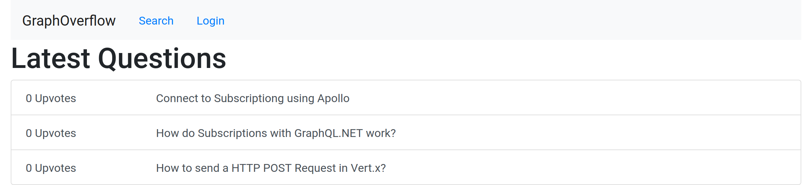

## Seite für eine Frage als anonymer Benutzer

Klickt der Benutzer auf eine Frage wird er zur Detailseite weitergeleitet, auf welcher die Frage mit Tags, Upvotes, allen Antworten und allen Kommentaren zu den Antworten angezeigt wird.
Die Seite für eine Frage ist auf der folgenden Abbildung zu sehen.

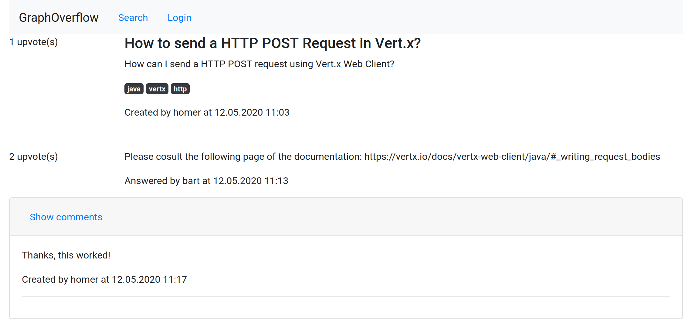

Hier erfolgt nun ein kleiner Vorgriff, der zeigt, dass die Subscriptions auch ohne Authentifzierung funktionieren.
Schreibt nun ein authentifizierter Benutzer einen Kommentar, wird dieser mittels der Subscription ohne Reload der Seite angezeigt.
Die folgende Abbildung zeigt die Sicht des Benutzers, welcher den Kommentar verfasst.

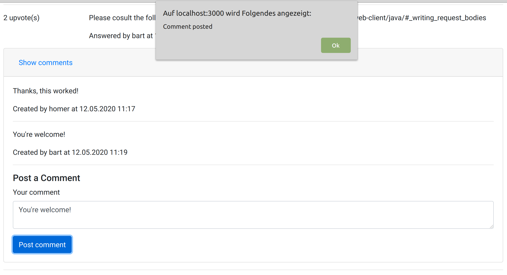

Ohne Reload wird der Kommentar nun in der Ansicht des anonymen Benutzers angezeigt, wie die folgende Abbildung zeigt.

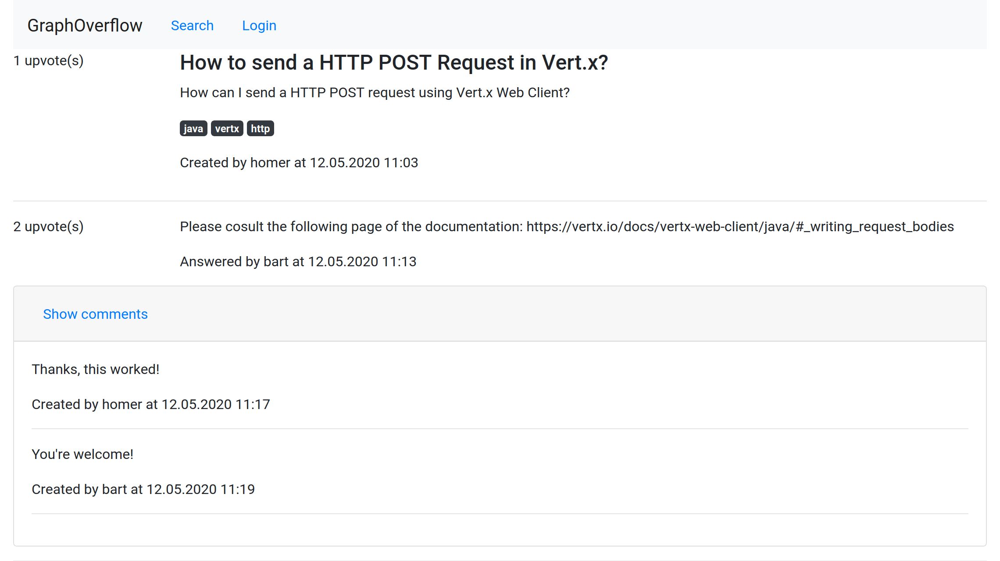

Die gleiche Funktionalität steht für die Anzeige von neuen Antworten zur Verfügung: Sobald ein Benutzer eine neuen Antwort verfasst, wird diese via Subscriptions an alle Clients, welche gerade die Frageseite anzeigen, gepusht und dort angezeigt.
Die unten zu sehende Abbildung zeigt die Sicht des Benutzers, welcher die Antwort verfasst.

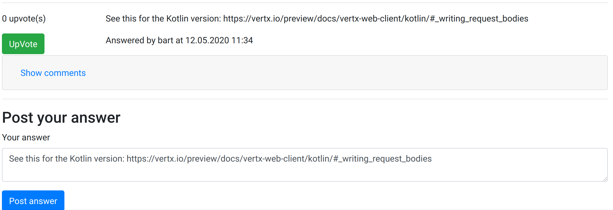

Auf der Seite des anonymen Benutzers wird die Antwort nun ohne Reload angezeigt, wie im folgenden Screenshot zu sehen ist.

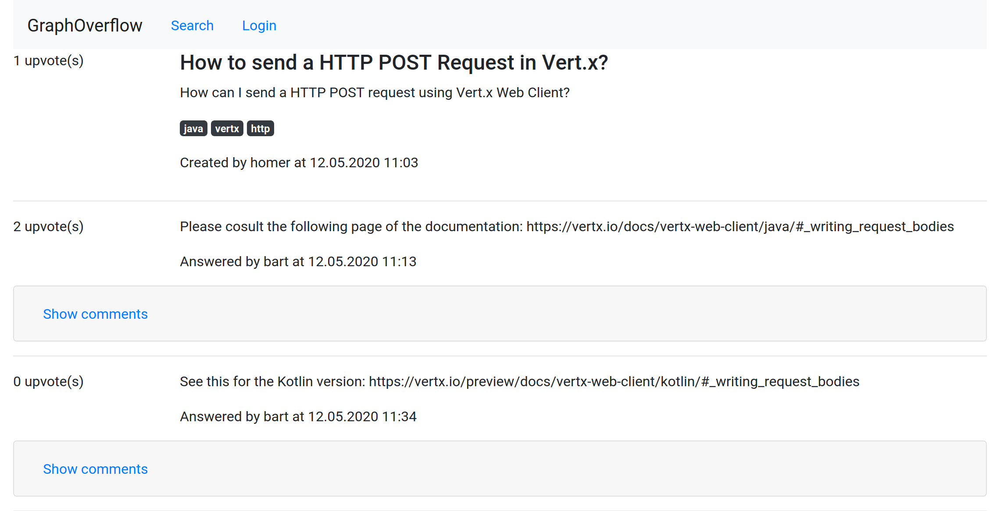

## Suche nach Tags

In der Suche kann jeder Benutzer nach Fragen zu bestimmten Tags suchen.
Bei Eingabe eines Suchbegriffes werden alle Fragen, die mit dem entsprechenden Tag versehen sind, angezeigt, wobei die Anzeige während des Tippens aktualisiert wird.

Der folgende Screenshot zeigt das Ergebnis der Suche nach dem Begriff "vert".
Wie erwartet, wird die zuvor gestellte Frage zum Thema [Vert.x](https://www.vertx.io/) angezeigt.

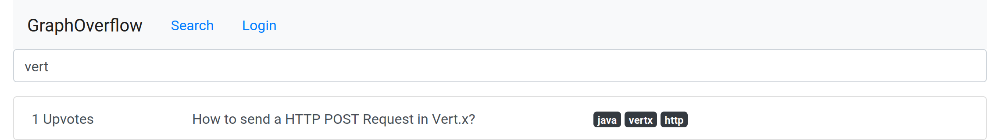

Das [verlinkte Video](doc/img/searchForTags.mp4) zeigt die Ergebnisse der Suchen nach den Begriffen "vertx" und "c#".


## Login

Nach einem Login steht dem Benutzer zusätzliche Funktionalität in Form des Erstellen von Fragen, Antworten und Kommentaren, dem Vergeben von Upvotes und der Anzeige der von ihm gestellten Fragen zur Verfügung.

Auf der Seite für den Login wird der Benutzer nun nach seinem Benutzernamen und Passwort gefragt, wie die folgende Abbildung zeigt.


Nach einem Login stehen auf der Startseite zusätzliche Links zum Stellen von Fragen sowie zur Anzeige der eigenen Fragen zur Verfügung.
Nach der erfolgten Weiterleitung auf die Startseite sind die Links nun in der Navigationsleiste sichtbar, wie die folgende Abbildung zeigt.

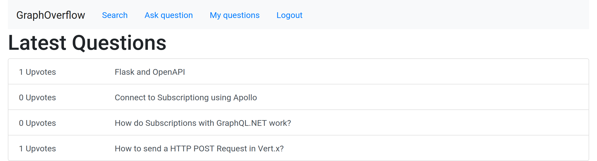

## Stellen von Fragen

Auf der Seite zur Erstellung einer Frage wird dem Benutzer ein Formular angezeigt, in welchem er Titel, eigentliche Frage und Tags vergeben kann.
Mehrere Tags sind dabei mit Doppelpunkten voneinander zu trennen.
Die unten ersichtliche Abbildung zeigt ein ausgefülltes Formular zur Erstellung einer Frage.

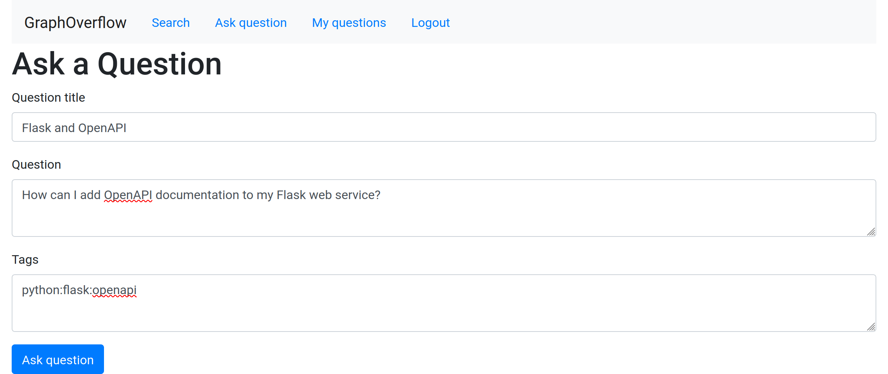

Nach dem Stellen der Frage wird der Benutzer auf die Seite für die Frage weitergeleitet, welche in der unteren Abbildung zu sehen ist.

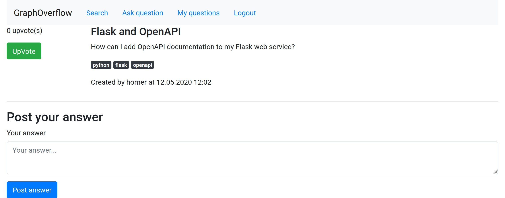

## Seite für eine Frage als authentifizierter Benutzer

### Upvotes für Fragen

Da der Benutzer nun eingeloggt ist, kann er durch Drücken des grünen Upvote-Buttons, welcher links neben der Frage in der oberen Abbildung zu sehen ist, einen Upvote für die Frage vergeben.
Dies führt dazu, dass der aktuelle Upvote-Count und die Liste der Benutzer, die einen Upvote vergeben haben, als Ergebnis der GraphQL-Manipulation an den Client gesendet wird und dieser die Anzeige enstprechend aktualisiert, sodass die Seite nun wie unten abgebildet dargestellt wird.

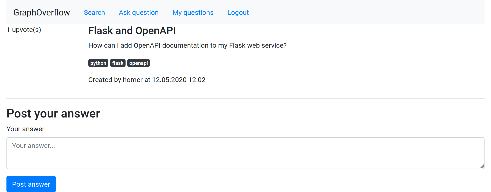

### Antworten

Nun können Benutzer Antworten für Fragen geben.
Die unten zu sehende Abbildung zeigt die Ansicht eines anderen authentifizierten Benutzers für das Beantworten einer Frage, bevor diese abgesendet wird.

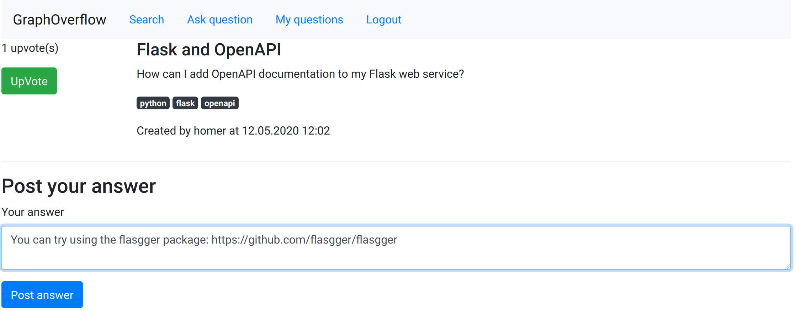

Auf beiden Seiten wird die neue Anwort nun mittels Subscriptions in die Liste der Antworten eingefügt.
Die untere Abbildung zeigt die Seite nach dem Absenden der Antwort und nach Bestätigung des Dialogs für den Benutzer, welcher die Antwort erstellt hat.

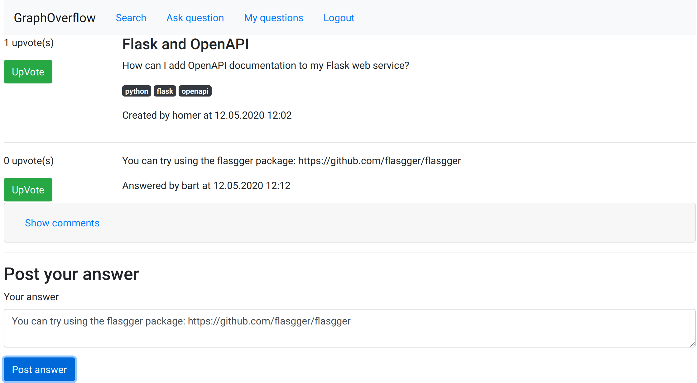

Auch für den anderen authentifizierten Benutzer, welcher die Frage erstellt hat, wird die neue Antwort angezeigt, wie die unten zu sehende Abbildung zeigt.

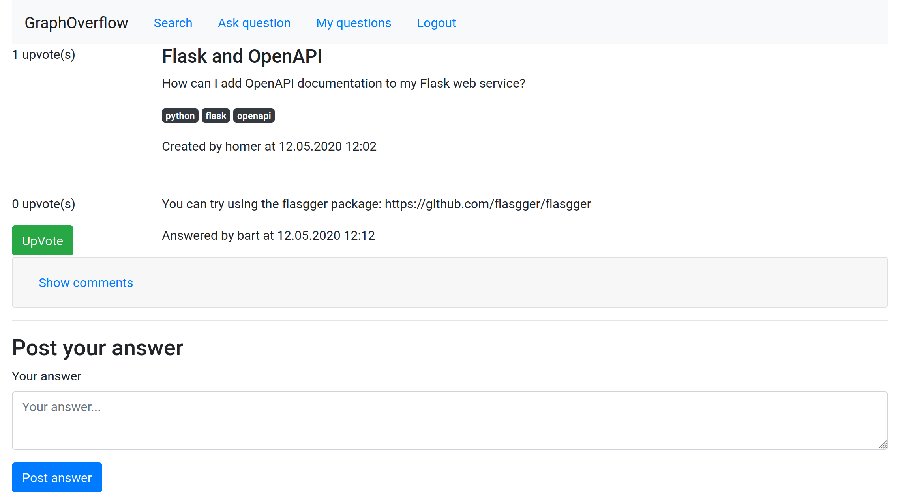

### Kommentare

Kommentare für eine Frage werden ebenfalls via Subscriptions an alle Clients, die gerade die entsprechende Frageseite anzeigen, verteilt.
Die unten zu sehende Abbildung zeigt die Seite aus Sicht eines Benutzers, welcher gerade einen Kommentar absenden möchte.

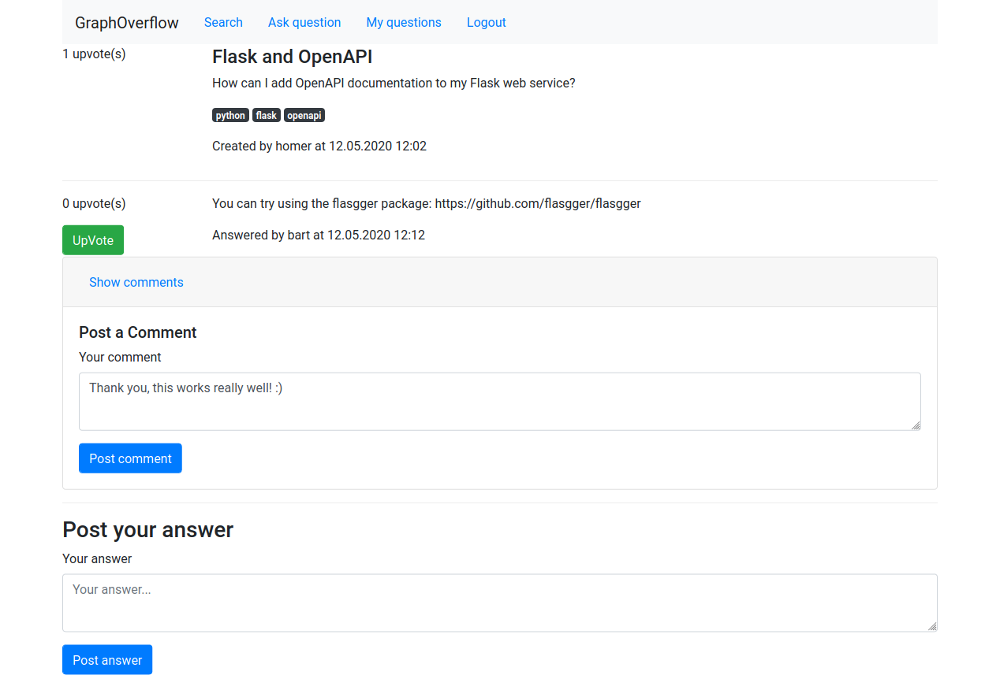

Da der Kommentar noch nicht gepostet ist, ist er für den anderen Benutzer logischerweise nicht sichtbar, wie der folgende Screenshot zeigt.

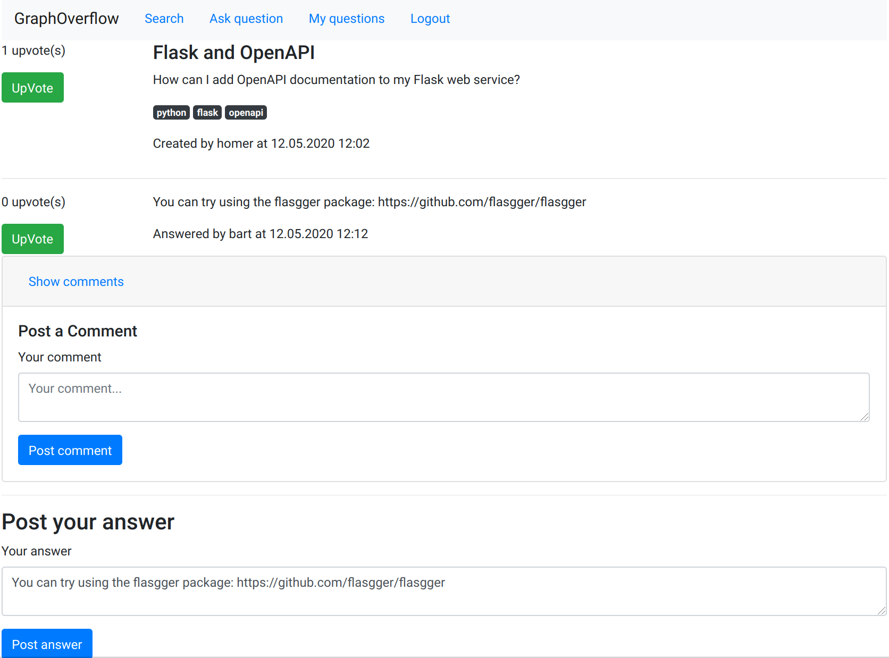

Schickt der Benutzer den Kommentar ab und bestätigt dieser die Erfolgsmeldung, wird der Kommentar in der entsprechenden Liste angezeigt, wie der folgende Screenshot zeigt.

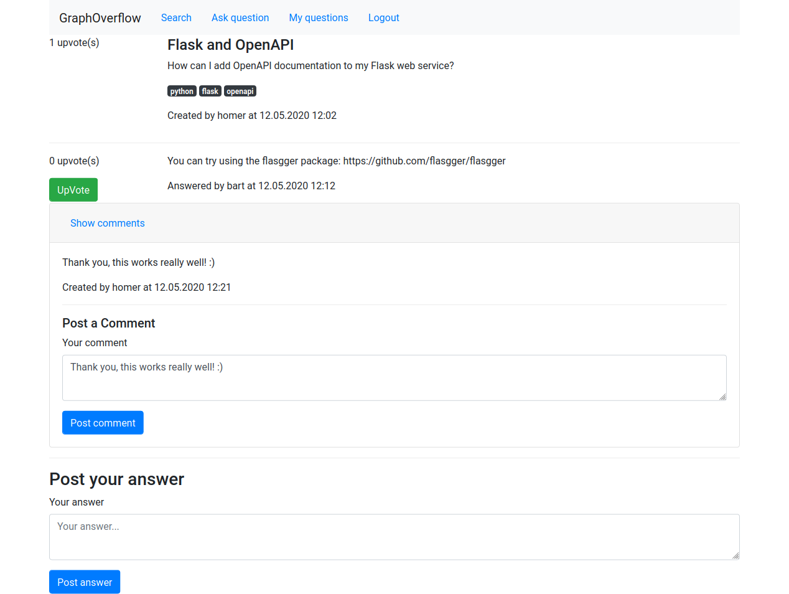

Auch für den anderen Benutzer wird der Kommentar ohne Reload zur Liste der Kommentare hinzugefügt.


### Upvotes für Antworten

Natürlich können auch Upvotes für hilfreiche Antworten vergeben werden, wobei ein Benutzer auch seine eigenen Antworten upvoten kann, sofern er diese für hilfreich empfindet.
Die Abbildung unten zeigt die Ansicht des Benutzers, welcher die Antwort erstellt hat, bevor er für diese einen Upvote vergibt.
Ein Upvote für eine Antwort kann durch Klick auf den grünen Buttons neben der Antwort vergeben werden.

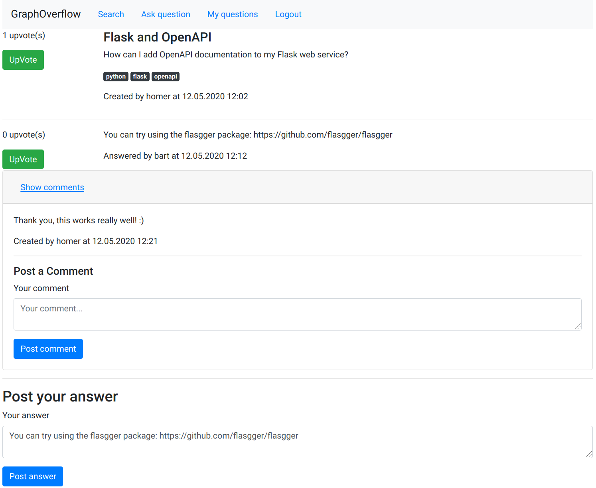

Klickt der Benutzer nun auf den grünen Button, wird ein Upvote vergeben, die aktuelle Anzahl der Upvotes sowie die Liste der Benutzer, welche einen Upvote vergeben haben, als Ergebnis der Mutation angefordert und die Änderungen werden im Frontend angezeigt, was in der unten zu sehenden Abbildung resultiert.

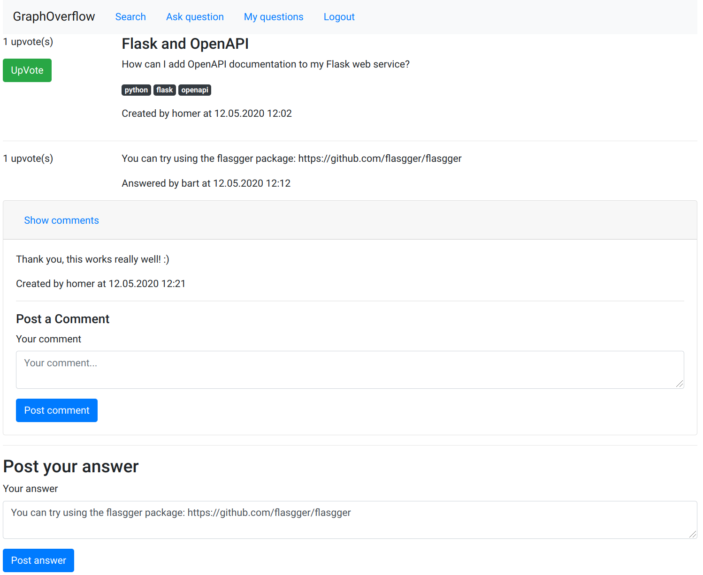

## Fragen, die der Benutzer gestellt hat

Abschließend kann sich der Benutzer noch seine eigenen Fragen und die Antworten darauf in einer Seite anzeigen lassen, wie das in der unteren Abbildung dargestellt wird.
In der unteren Abbildung ist zu sehen, dass die Frage zu Subscriptions mit Apollo nicht angezeigt wird, da sie von einem anderen Benutzer stammt.
Ebenfalls werden die Antworten mittels eines Data-Loaders geladen, sodass nur zwei SQL-Statements anfallen: Eines für das Laden der Fragen und eines für das Laden aller Antworten auf die Fragen eines Benuzters.

Ebenso wird hier die selbe GraphQL-Query verwendet wie für das Laden der Fragen auf der Startseite, nur dass zusätzlich die Antworten mitgeladen werden.
Dies demonstriert die hohe Flexibilität der Abfragesprache GraphQL.


