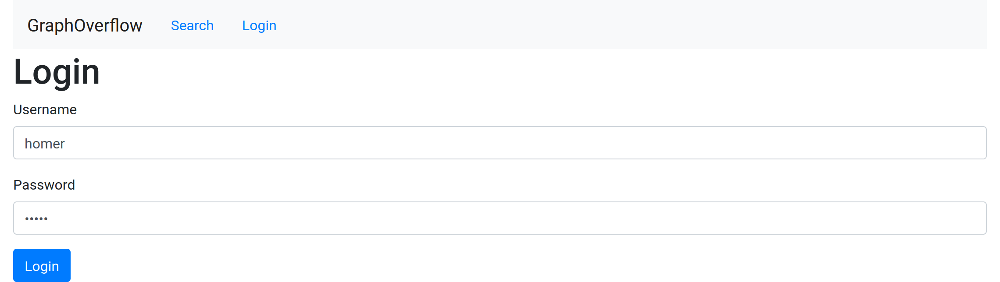
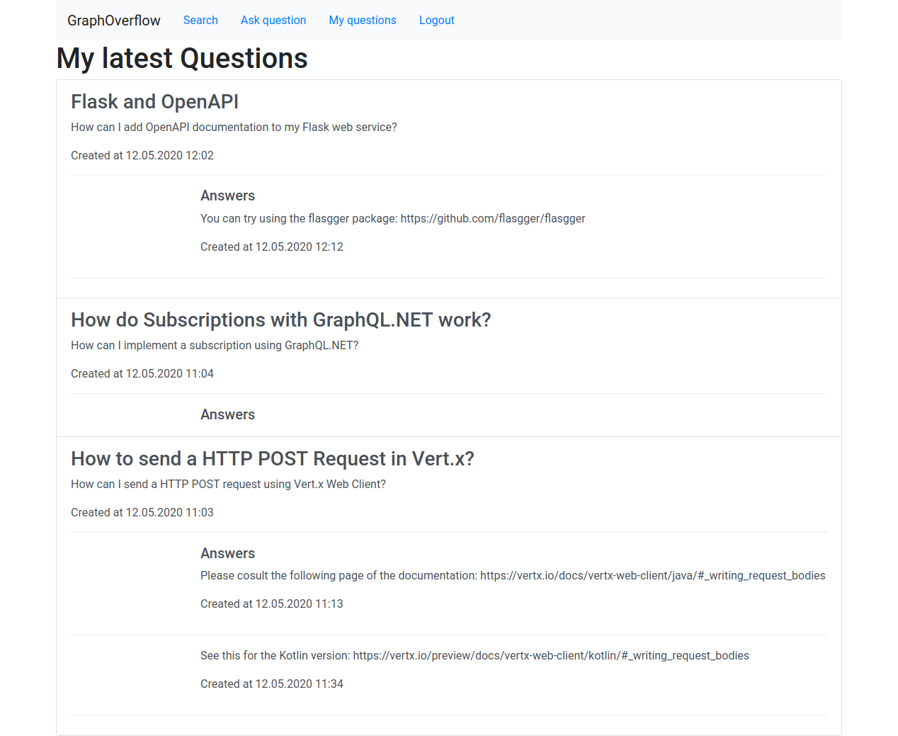

<!-- START doctoc generated TOC please keep comment here to allow auto update -->
<!-- DON'T EDIT THIS SECTION, INSTEAD RE-RUN doctoc TO UPDATE -->
**Table of Contents**  *generated with [DocToc](https://github.com/thlorenz/doctoc)*

- [Aufgabenstellung](#aufgabenstellung)
- [Architektur](#architektur)
- [Setup](#setup)
	- [GraphQL Server](#graphql-server)
		- [Data-Loader](#data-loader)
	- [Apollo-React-Client](#apollo-react-client)
		- [NPM-Packages](#npm-packages)
		- [GraphQL-Client-Setup](#graphql-client-setup)
		- [GraphQL-Client-Generator](#graphql-client-generator)
- [Schema](#schema)
	- [Schema mit GraphQL .NET](#schema-mit-graphql-net)
- [Queries](#queries)
	- [Server](#server)
	- [Data-Loader](#data-loader-1)
	- [Client](#client)
- [Mutations](#mutations)
	- [Server](#server-1)
	- [Client](#client-1)
		- [Implementierung des Upvotes](#implementierung-des-upvotes)
		- [Formulare](#formulare)
- [Subscriptions](#subscriptions)
	- [Server](#server-2)
		- [Resolver und Subscriber](#resolver-und-subscriber)
		- [Geschäftslogik](#gesch%c3%a4ftslogik)
	- [Client](#client-2)
- [Login](#login)
	- [Server](#server-3)
	- [Client](#client-3)
- [Ergebnisse](#ergebnisse)
	- [Startseite](#startseite)
	- [Seite für eine Frage als anonymer Benutzer](#seite-f%c3%bcr-eine-frage-als-anonymer-benutzer)
	- [Suche nach Tags](#suche-nach-tags)
	- [Login](#login-1)
	- [Stellen von Fragen](#stellen-von-fragen)
	- [Seite für eine Frage als authentifizierter Benutzer](#seite-f%c3%bcr-eine-frage-als-authentifizierter-benutzer)
		- [Upvotes für Fragen](#upvotes-f%c3%bcr-fragen)
		- [Antworten](#antworten)
		- [Kommentare](#kommentare)
		- [Upvotes für Antworten](#upvotes-f%c3%bcr-antworten)
	- [Fragen, die der Benutzer gestellt hat](#fragen-die-der-benutzer-gestellt-hat)

<!-- END doctoc generated TOC please keep comment here to allow auto update -->

# Aufgabenstellung
Q&A-Plattform GraphOverflow: Benutzer können Fragen stellen, zu welchen andere Benutzer Antworten geben können. Auf Antworten können Kommentare gegeben werden. Kommentare und Antworten können als hilfreich markiert werden, was als Sortierkriterium verwendet wird. Änderungen werden dabei an die Clients vom Server via Subscription gepusht. Darüber hinaus kann sich ein Benutzer von ihm gestellte Fragen und gegebene Antworten anzeigen lassen. Ebenso soll eine Suche das Anzeigen von Fragen für bestimmte Themen ermöglichen. Der Client wird als React-basierte SPA realisiert.

# Architektur

Unsere Anwendung ist als Client-Server-System realisiert.
Der Server ist dabei mit dem ASP.NET Core und [GraphQL Server](https://github.com/graphql-dotnet/server/) realisiert, während der Client als SPA mit [React](https://www.reactjs.org/), TypeScript und dem [Apollo-Client für React](https://www.apollographql.com/docs/react/) entwickelt ist.

Als Datenbank kommt PostgreSQL zum Einsatz und der Server ist erneut als dreischichtige Anwendung realisiert.


# Setup

Da uns das Setup der Projekte einige Probleme bereitet hat, möchten wir in diesem Abschnitt darauf eingehen, wie wir zu einer für uns funktionierenden Konfiguration gelangt sind.

## GraphQL Server

Zur Umsetzung des GraphQL Service haben wird uns für das Framework **GraphQL.NET** entschieden. Diese Framework bietet zwei Möglichkeiten zur Definition eines GraphQL-Schemas, nämlich den Schema First Approach und den GraphType First Approach. Wir haben uns für den GraphType First Approach entschieden.

Mit diesem Framework kann ein Schema bestehend aus den Root Operations Typen Query und Mutation gut umgesetzt werden. Weiters erlaubt es dieses Framework einen REST Post-Endpunkt für Abfragen zu definieren. Diese werden anschließend an den `DocumentExecutor` des Frameworks übergeben, welcher anschließend die Abfrage auf dem zugrunde liegenden Schema auswertet. Es ist jedoch mit diesem Framework alleine nicht möglich den Root operations Typ Subscription umzusetzen. Dazu wird in der Dokumentation von [GraphQL .NET](https://graphql-dotnet.github.io/docs/getting-started/subscriptions) auf das Projekt [GraphQL Server](https://github.com/graphql-dotnet/server/) verwiesen, da ein Server benötigt wird, welcher das Subscription Protokoll implementiert.

Das GraphQL Server Projekt setzt auf das Framework GraphQL.NET auf und stellt einen .NET Core Server zur Verfügung welcher das Apollo GraphQL Subscription Protokoll implementiert. Für das Setup werden die nachfolgend angeführten Nuget Pakete benötigt. Da die derzeitige Version 3.4.0 mit einigen Fehlern behaftet ist (gemäß der Dokumentation) wird empfohlen auf die Alpha Version 3.5.0 auszuweichen. Diese Version beinhaltet jedoch Änderungen des Frameworks GraphQL.NET welche nicht mehr mit der aktuellen Version 2.4.0 kompatibel sind. 

Um den GraphQL Server verwenden zu können werden folgende Nuget Pakete benötigt:
```
Install-Package GraphQL.Server.Transports.AspNetCore -Version 3.5.0-alpha0046
```
```
Install-Package GraphQL.Server.Transports.AspNetCore.SystemTextJson -Version 3.5.0-alpha0046
```
```
Install-Package GraphQL.Server.Transports.WebSockets -Version 3.5.0-alpha0046
```

Integriert werden kann der GraphQL Server in ASP.NET Core mittels der GraphQL Middleware. Diese kann wie folgt in der Klasse `Startup` konfiguriert werden.

```C#
public void ConfigureServices(IServiceCollection services)
{
	// ...
	services.AddSingleton<IValidationRule, RequiresAuthValidationRule>();
	// Add GraphQL services and configure options
	services
			.AddSingleton<GraphQlSchema>()
			.AddGraphQL(options =>
			{
				options.EnableMetrics = false;
				//options.EnableMetrics = Environment.IsDevelopment();
				options.ExposeExceptions = Environment.IsDevelopment();
			})
			.AddUserContextBuilder(GraphQlUserContext.UserContextCreator)
			.AddSystemTextJson(deserializerSettings => { }, serializerSettings => { })
			.AddWebSockets() // Add required services for web socket support
			.AddDataLoader() // Add required services for DataLoader support
			.AddGraphTypes(typeof(GraphQlSchema)); // Add all IGraphType implementors in assembly which GraphQlSchema exists
}

public void Configure(IApplicationBuilder app, IWebHostEnvironment env)
{
	//...
	app.UseWebSockets();
	app.UseGraphQLWebSockets<GraphQlSchema>(GRAPHIQL_API_ENDPOINT);

	app.UseGraphQL<GraphQlSchema, GraphQLHttpMiddlewareWithLogs<GraphQlSchema>>(GRAPHIQL_API_ENDPOINT);

	app.UseGraphiQLServer(new GraphiQLOptions
	{
		GraphiQLPath = GRAPHIQL_ENDPOINT,
		GraphQLEndPoint = GRAPHIQL_API_ENDPOINT,
	});

	app.UseGraphQLPlayground(new GraphQLPlaygroundOptions
	{
		Path = "/ui/playground",
		GraphQLEndPoint = GRAPHIQL_API_ENDPOINT
	});
}
```

### Data-Loader

Um die Funktionalität für den Data-Loader zu aktivieren, müssen die entsprechenden Services in den DI-Container injiziert werden.
Hierfür kann die im unteren Snippet gezeigte Extension-Method verwendet werden.

```c#
using GraphQL.Server;

namespace GraphOverflow.WebService
{
	public class Startup
	{
		// ...

		public void ConfigureServices(IServiceCollection services)
		{
			// ...
			services.AddDataLoader();
			// ...
		}

		// ...
	}
}
```

## Apollo-React-Client

### NPM-Packages

Die Installation des Apollo-Clients erfordert zusätzliche Packages, was in der Dokumentation leider nicht allzu gut beschrieben ist.
Insbesondere für die Subscriptions sind zusätzliche Packages erforderlich.
Das unten stehende Kommando listet alle Pakete auf, die für den Apollo-React-Client benötigt werden.

```bash
npm install --save apollo-boost @apollo/react-hooks graphql apollo-cache-inmemory apollo-client apollo-link-http apollo-link-ws graphql-tag subscriptions-transport-ws
```

### GraphQL-Client-Setup

Der nächste Schritt besteht darin, den Apollo-Client in der React-Anwendung verfügbar zu machen.
Hierzu ist in der Datei `index.tsx`, welche vom [React-Projekt-Generator](https://reactjs.org/docs/create-a-new-react-app.html#create-react-app) erzeugt wird, eine Instanz des Clients anzulegen.

Jede Instanz benötigt hierzu einen Link und einen Cache.
Der Cache wird einfach als In-Memory-Cache realisiert und kann mit derunten zu sehenden Anweisung erzeugt werden.

```typescript
const cache = new InMemoryCache();
```

Der Apollo-Link repräsentiert die Verbindung zum GraphQL-Server.
Das Apollo-Framework ermöglicht es dabei Links wie Middleware-Komponenten in ASP.NET Core als Kette zu repräsentieren.
Dies wird von uns genutzt, um Queries sowie Mutations über einen HTTP-Link mit Authentifizierung auszuführen, während die Daten für Subscriptions über einen dedizierten Web-Socket-Link übertragen werden.

Das untere Snippet zeigt den Code zur Erstellung des Http-Links sowie eines Middleware-Providers, welcher den Authentifizierungs-Token, sofern dieser vorhanden ist, aus dem Local-Storage in den HTTP-Header kopiert.

```typescript
const httpLink = createHttpLink({
	uri: "http://127.0.0.1:5000/api/graphql/"
});
const authenticationLink = setContext((_, { headers }) => {
	const token = getLoginToken();
	return {
		headers: {
			...headers,
			authorization: token ? token : "",
		}
	};
});
```

Der unten zu sehende Quellcodeauszug zeigt den Code, welcher zur Erstellung des Web-Socket-Links für Subscriptions erforderlich ist.
Zusätzlich wird mittels eines Splits festgelegt, dass Subscriptions vom Web-Socket-Link verarbeitet werden, während der HTTP-Link mit verkettetem Authentifizierungs-Handler für alle übrigen Operationen verwendet wird.

```typescript
const webSocketLink = new WebSocketLink({
	uri: "ws://127.0.0.1:5000/api/graphql",
	options: {
		reconnect: true
	}
});
const apolloLink = split(
	({ query }) => {
		const definition = getMainDefinition(query);
		return definition.kind === "OperationDefinition" && definition.operation === "subscription";
	},
	webSocketLink,
	authenticationLink.concat(httpLink)
);
```

Abschließend wird ein Apollo-Client instanziiert und als React-Hook den React-Komponenten zur Verfügung gestellt.
Um letzteres zu ermöglichen, wird der instanziierte Client der React-Componente `<ApolloProvider>` als Property übergeben.

```typescript
const client = new ApolloClient({
	cache,
	link: apolloLink
});

ReactDOM.render(
	<React.StrictMode>
		<Router>
			<ApolloProvider client={client}>
				<App />
			</ApolloProvider>
		</Router>
	</React.StrictMode>,
	document.getElementById("root")
);
```

### GraphQL-Client-Generator

Mit der bisherigen Konfiguration kann nun die von Apollo zur Verfügung gestellte Funktionalität vollständig genutzt werden.
Allerdings werden von Apollo anhand der GraphQL-Operationen und des vom Server bereitgestellten Schemas noch keine DTOs zur typsicheren Repräsentation der Daten generiert.

Um die Generierung von DTOs zu ermöglichen, wird das Projekt [GraphQL-Code-Generator](https://github.com/dotansimha/graphql-code-generator) eingesetzt.
Darüber hinaus bietet dieses Projekt den Vorteil, dass ebenfalls React-Komponenten, welche eine Operation repräsentieren, anhand von GraphQL-Abfragen generiert werden können.

Um den Generator verwenden zu können, sind die folgenden Pakete als Entwicklungsumgebungs-Abhängigkeiten mit dem unten ersichtlichen Kommando zu installieren.

```bash
npm install --save-dev @graphql-codegen/cli
```

Anschließend ist der Generator noch zu initialiseren, was mit der Anweisung `npx graphql-codegen init
` erfolgt.
Als Applikationstyp ist dabei die bereits vorgeschlagene Option `Application built with React` auszuwählen.
Als Schema-URL ist der GraphQL-POST-Endpunkt, der bereits zur Konfiguration des Apollo-Clients festgelegt wurde, einzugeben, nämlich `http://127.0.0.1:5000/api/graphql`.
Bei der Frage, wo die Dateien mit den GraphQL-Operationen und -Fragmenten liegen, kann der vorgeschlagene Wert `src/**/*.graphql` beibehalten werden.
Bei den zu verwendenden Plugins können ebenfalls die vorgeschlagenen Plugins `TypeScript`, `TypeScript Operations` und `TypeScript React Apollo` ausgewählt werden.
Als Datei, in welche die generierten Typen gespeichert werden, haben wir `src/graphql/GraphQlTypes.tsx` ausgewählt.
Auf die Generierung einer Introspection-Datei haben wir verzichtet.
Als Namen für die Konfigurationsdatei des Generators wird der vorgeschlagene Name `codegen.yml` verwendet.
Abschließend wird als Eingabe für den Namen des Befehls zur Ausführung des Codegenerator `codegen` eingegeben.
Die finale Ausgabe zeigt dann noch die Befehle zur Installation der Plugins sowie zur Ausführung des Codegenerators an.

Es wurde, den [offiziellen Code-Generator von Apollo](https://github.com/apollographql/apollo-tooling) zu verwenden, allerdings mit eher bescheidenem Erfolg: Auf der offiziellen Projektseite ist keine wirkliche Anleitung vorzufinden und die [Anweisungen in Blog-Posts](https://www.leighhalliday.com/generating-types-apollo) haben nicht funktioniert.

# Schema

Für den GraphQL Service wurde folgendes Schema definiert:
```graphql
type Answer implements PostInterface {
  comments: [Comment!]!
  content: String!
  createdAt: DateTime!
  id: ID!
  question: Question!
  upVotes: Long!
  upVoteUsers: [User!]!
  user: User!
}

type AuthPayload {
  token: String!
  user: User!
}

type Comment implements PostInterface {
  answer: Answer!
  content: String!
  createdAt: DateTime!
  id: ID!
  upVotes: Long!
  upVoteUsers: [User!]!
  user: User!
}

type Mutation {
  # adds a graphoverflow tag
  addTag(tagName: String!): Tag
  # adds an answer
  answerQuestion(questionId: Int!, content: String!): Answer
  # adds a question
  askQuestion(question: QuestionInput!): Question
  # adds a comment
  commentAnswer(answerId: Int!, content: String!): Comment
  # user login
  login(loginData: UserLoginInput!): AuthPayload
  # upVote answer
  upVoteAnswer(answerId: Int!): Answer
  # upVote question
  upVoteQuestion(questionId: Int!): Question
}

interface PostInterface {
  content: String!
  createdAt: DateTime!
  id: ID!
  upVotes: Long!
  upVoteUsers: [User!]!
}

type Query {
  allTags: [Tag!]!
  # load all questions
  latestQuestions(
    # ID of the user to fetch questions for
    userId: Int = -1
  ): [Question!]!
  me: User
  # load a question
  question(
    # Question ID
    id: Int
  ): Question!
  # load questions filtered by tag
  questionsByTag(tagName: String): [Question!]!
  # get all tags that match the %tagName%
  tags(tagName: String): [Tag!]!
}

type Question implements PostInterface {
  answers: [Answer!]!
  content: String!
  createdAt: DateTime!
  id: ID!
  tags: [Tag!]!
  title: String!
  upVotes: Long!
  upVoteUsers: [User!]!
  user: User!
}

input QuestionInput {
  title: String!
  content: String!
  tags: [String!]!
}

type Subscription {
  answerAdded(
    # ID of the question to listen to new answers for
    questionId: Int!
  ): Answer
  commentAddedToAnswerOfQuestion(
    # ID of the question to listen to new comments to answers for
    questionId: Int!
  ): Comment
}

type Tag {
  id: ID!
  name: String!
  questions: [Question!]!
}

type User {
  id: ID!
  name: String!
}

input UserLoginInput {
  userName: String!
  password: String!
}
```

## Schema mit GraphQL .NET
Das Schema bildet die Definition des Typsystems des GraphQL Service. Es bestimmt die zur Verfügung stehenden Root Operations Typen (In unserem Beispiel: Query, Mutation, Subscription). Das Schema muss von der Klasse `Schema` abgeleitet werden. Interessant war hierbei auch, dass an die Basisklasse ein Objekt vom Typ `IServiceProvider` übergeben werden kann, welches anschließend für Dependency Injection in den Graphtypen verwendet wird. 
```C#
using GraphQL.Types;
// ...
public class GraphQlSchema : Schema
  {
    public GraphQlSchema(ITagService tagService, 
      IQuestionService questionService, 
      IAuthenticationService authenticationService,
      IAnswerService answerService,
      IServiceProvider provider,
      IUserService userService,
      ICommentService commentService) 
      : base(provider)
    {
      Query = new QueryType(tagService, questionService, answerService, userService);
      Mutation = new MutationType(tagService, questionService, answerService, authenticationService, commentService);
      Subscription = new SubscriptionType(answerService, commentService);
    }
  }
```

# Queries

## Server

Queries sind lesende Abfragen, welche an den GraphQL Service gesendet werden können. Im Typsystem muss ein Query Graphtyp definiert werden, welcher die Einstiegspunkte in den zugrunde liegenden Graphen (das Typsystem) definiert. Hierfür muss eine Klasse definiert werden, welche wie alle Output Graphtypen von der Basisklasse `ObjectGraphType` abgeleitet werden. In dieser Klasse können dann Felder mitsamt ihren Resolver Methoden definiert werden, welche als Einstiegspunkte zum traversieren des Graphen dienen.

Ein Feld entspricht im wesentlichen einer Funktion, welche Argumente entgegennehmen und einen Wert retournieren kann. Ein Feld `Field<UserGraphType>(...)` besteht dabei immer mindestens aus einem Output Graphtypen (von `ObjectGraphType` abgleiteten Klassen) und einem Namen. Der Output Graphtyp beschreibt dabei den Typ des Rückgabewerts. Weiters können Parameter und Resolver Methoden definiert werden. Im `QueryTyp` werden für alle Felder Resolver Methoden definiert, da es keine Quelle gibt, aus welcher die Feldwerte implizit ermittelt werden können. An dieser Stelle ist jedoch darauf hinzuweisen, dass keine Output Graphtypen als Parameter Typen verwendet werden können. Hierfür müssen eigene Input Graphtypen mitsamt ihren Feldern deifniert werden, welche von der Klasse `InputObjectGraphType<...>` abgleitet werden müssen. Skalare Parametertypen können jedoch ohne weiteres als Output- sowie auch als Input GraphTypen verwendet werden.

Zum ermitteln der einzelnen Feldwerte werden Services an den Graphtypen mittels Dependency Injection übergeben, welche anschließend in den Resolver Methoden verwendet werden.

```C#
public class QueryType : ObjectGraphType
{
	#region Members
	private readonly ITagService tagService;
	private readonly IQuestionService questionService;
	private readonly IAnswerService answerService;
	private readonly IUserService userService;
	#endregion Members

	#region Construction
	public QueryType(ITagService tagService, IQuestionService questionService, IAnswerService answerService, IUserService userService)
	{
		this.tagService = tagService;
		this.questionService = questionService;
		this.answerService = answerService;
		this.userService = userService;
		InitializeTypeName();
		InitializeFields();
	}

	private void InitializeTypeName()
	{
		Name = "Query";
	}

	private void InitializeFields()
	{
		var meField = Field<UserGraphType>(name: "me", resolve: ResolveUser);
		meField.RequirePermission(UserPermissionConstants.USER_PERMISSION);

		Field<NonNullGraphType<ListGraphType<NonNullGraphType<TagType>>>>(
			name: "allTags", resolve: ResolveAllTags
		);

		Field<NonNullGraphType<ListGraphType<NonNullGraphType<TagType>>>>(
			name: "tags",
			resolve: ResolveTags,
			arguments: new QueryArguments(new QueryArgument<StringGraphType>() 
				{ 
					Name = "tagName",
					DefaultValue = string.Empty 
				}
			)
		).Description = "get all tags that match the %tagName%";

		Field<NonNullGraphType<ListGraphType<NonNullGraphType<QuestionType>>>>(
			name: "latestQuestions",
			resolve: ResolveLatestQuestions,
			arguments: new QueryArguments(new QueryArgument<IntGraphType>
			{
				Name = "userId",
				DefaultValue = (-1),
				Description = "ID of the user to fetch questions for"
			})
		).Description = "load all questions";

		Field<NonNullGraphType<ListGraphType<NonNullGraphType<QuestionType>>>>(
			name: "questionsByTag",
			arguments: new QueryArguments(new QueryArgument<StringGraphType>()
			{
				Name = "tagName",
				DefaultValue = string.Empty
			}
			),
			resolve: ResolveQuestionsByTag
		).Description = "load questions filtered by tag";

		Field<NonNullGraphType<QuestionType>>(
			name: "question",
			arguments: new QueryArguments(
				new QueryArgument<IntGraphType>
				{
					Name = "id",
					Description = "Question ID"
				}
			),
			resolve: ResolveQuestion
		).Description = "load a question";
	}
	#endregion Construction

	#region Resolvers

	public async Task<object> ResolveUser(IResolveFieldContext<object> context)
	{
		GraphQlUserContext userContext = context.UserContext as GraphQlUserContext;
		var userId = userContext.User.Id;
		return await userService.FindUserById(userId);
	}

	public object ResolveAllTags(IResolveFieldContext<object> context)
	{
		return tagService.FindAllTags();
	}

	private object ResolveTags(IResolveFieldContext<object> context)
	{
		var tagName = context.Arguments["tagName"] as string;
		return tagService.FindAllTagsByName(tagName);
	}

	private async Task<object> ResolveLatestQuestions(IResolveFieldContext<object> context)
	{
		int userId = (int) context.Arguments["userId"];
		if (userId != (-1))
		{
			return await questionService.FindLatestQuestionsByUserId(userId);
		}
		else
		{
			return await questionService.FindLatestQuestions();
		}
	}

	private async Task<object> ResolveQuestion(IResolveFieldContext<object> context)
	{
		int questionId = (int)context.Arguments["id"];
		var question = await questionService.FindQuestionById(questionId);
		return question;
	}

	private async Task<object> ResolveQuestionsByTag(IResolveFieldContext<object> context)
	{
		var tagName = context.Arguments["tagName"] as string;
		return await questionService.FindQuestionsByTagName(tagName);

	}
	#endregion Resolvers
}
```

## Data-Loader

Fragen und Antworten befinden sich in einer 1:N-Beziehung, was bedeutet, dass im Resolver für eine Frage die Antworten bei Anforderung des Clients nachgeladen werden.
Dies hat jedoch den Nachteil, dass wenn der Client eine Menge an Fragen anfordert, für jede Frage einzeln eine SQL-Abfrage zum Nachladen der Antworten abgesetzt wird, was zu einem N+1-Selects-Problem führt.

Da dies sehr häufig vorkommt, wird ein Data-Loader zum Laden der Antworten für eine Frage eingesetzt.
Dieser ermöglicht es, dass das Laden der Antworten in einem Batch mit nur einem SQL-Statement erfolgt und somit wird die Anzahl der SQL-Statements konstant auf 2 reduziert: eines zum Laden der Fragen und eines zum Laden der Antworten.
Dies funktioniert, indem der Data-Loader mittels eines SQL-Statements alle Antworten zu allen vom Client angeforderten Fragen lädt und anschließend die Antworten den entsprechenden Fragen zugeordnet werden.

Als Nächstes ist in den Resolver für den Schema-Typ `QuestionType` eine Instanz der Klasse `IDataLoaderContextAccessor` zu injizieren, welche dann in der Resolver-Methode für die Antworten verwendet werden kann, um die Antworten als Batch zu laden.
Anschließend kann mittels des Data-Loaders die Operation zum Laden der Antworten aller Fragen geschedulet werden, wie das folgende Snippet zeigt.

```c#

public class QuestionType : ObjectGraphType<QuestionDto>
{
	private object ResolveAnswers(IResolveFieldContext<QuestionDto> context)
	{
		var question = context.Source;
		var answersLoader = this.dataLoaderContextAccessor.Context
			.GetOrAddCollectionBatchLoader<QuestionDto, AnswerDto>(
				"FindAnswersForQuestions",
				answerService.FindAnswersForQuestions
			);
		return answersLoader.LoadAsync(question);
	}
}
```

Die Methode der Geschäftslogik muss von der Schnittstelle ebenfalls an den Data-Loader angepasst werden, wie im folgenden Quellcodeauszug zu sehen ist.

```c#
public interface IAnswerService
{
	Task<ILookup<QuestionDto, AnswerDto>> FindAnswersForQuestions(IEnumerable<QuestionDto> questions);
}
```

Die Implementierung der Geschäftslogik ruft eine Methode der Datenzugriffsschicht, welche alle Antworten für eine Frage lädt, mappt diese in DTOs und transformiert die Ergebnisse anschließend in die von der Schnittstelle `ILookup` vorgegebene Datenstruktur, indem jedes Antwort-DTO seinem entsprechenden Frage-DTO zugeordnet wird..

```c#
	public async Task<ILookup<QuestionDto, AnswerDto>> FindAnswersForQuestions(IEnumerable<QuestionDto> questions)
	{
		IEnumerable<Answer> answers = await this.answerDao.FindAnswersByIds(
			questions.Select(question => question.Id)
		);
		return answers
			.Select(answer => MapAnswer(answer))
			.ToLookup(answer => questions.First(question => question.Id == answer.QuestionId));
	}
```

Als Nächstes zeigt die Schnittstelle der Datenzugriffsschicht, dass die Methode, welche von der Geschäftslogikschicht zum Laden aller Antworten für eine Aufzählung von Frage-IDs, eine Aufzählung aller Antworten zurückliefert.

```c#
public interface IAnswerDao
{
	Task<IEnumerable<Answer>> FindAnswersByIds(IEnumerable<int> questionIds);
}
```

Abschließend ist noch die SQL-Abfrage, welche vom DAO-Objekt zur Laden aller Antworten auf die übergebenen Frage-IDs verwendet wird, angegeben.
Diese Abfrage verwendet mit `ANY` eine mit [C# und ADO.NET kompatible Form](https://www.ankursheel.com/blog/query-in-clause-dapper-npgsql/) von `IN`.

```sql
SELECT a.id AS id, a.content, a.created_at, a.user_id, a.question_id,
	(SELECT count(*) FROM answer_up_vote WHERE answer_id = a.id) AS up_votes
FROM answer AS a
WHERE a.question_id = ANY(@questionIds)
```

## Client

Für die Generierung des GraphQL-Client-Codes wird das Projekt [GraphQL-Code-Generator](https://github.com/dotansimha/graphql-code-generator) eingesetzt.
Dieses generiert aus GraphQL-Queries React-Komponenten, mit denen diese Abfragen abgesetzt werden und die Ergebnisse dann direkt visualisiert werden können.

Hierzu ist zu Beginn die Abfrage zu erstellen und in einer Datei mit der Endung `.graphql` im Verzeichnis `src/graphql` zu speichern.
Z.B. ist die Abfrage zum Anzeigen der Abfragen eines Benutzers in der Datei `src/graphql/myQuestions.graphql` gespeichert, deren Inhalt im folgenden Quellcodeauszug ersichtlich ist.

```graphql
query myQuestions($userId: Int!) {
  latestQuestions(userId: $userId) {
	id
	title
	content
	createdAt
	upVotes
	answers {
	  id
	  content
	  createdAt
	  upVotes
	}
  }
}
```

Durch Ausführung des Befehls `npm run codegen` werden nun die DTOs sowie Komponenten generiert und in der Datei `src/graphql/GraphQlTypes.tsx` gespeichert.

Nun kann die generierte Komponente in die Komponente zur Anzeige eingebunden werden und mit dieser die Abfrage ausgeführt werden.
Dies wird im folgenden Quellcodeasuzug für die Komponente `MyQuestionList`, welche die generierte Komponente `MyQuestionsComponent` verwendet, demonstriert.
Beim Rendern der Komponente wird die GraphQL-Abfrage abgesetzt, wobei die Variable `$userId` entsprechend gebunden wird.

Im Body der Komponente `MyQuestionsComponent` wird zuerst überprüft, ob die Abfrage noch durchgeführt wird, einen Fehler oder ein Ergebnis zurückgeliefert hat.
Wurde ein Ergebnis zurückgeliefert, können die Komponenten der Variable `data` verwendet werden, um die eigentliche Ausgabe zu visualisieren.
Hierbei sind für alle Elemente enstprechende TypeScript-Interfaces vorhanden.
Diese werden als Schnittmenge des GraphQL-Typs mit den von der Abfrage zurückgelieferten Feldern gebildet, sodass nur auf Properties zugegriffen werden kann, die auch wirklich Teil des Abfrageergebnisses sind.

```tsx
// ...
import { MyQuestionsComponent } from "../graphql/GraphQlTypes";

// ...

class MyQuestionList extends React.Component<MyQuestionListProperties, MyQuestionListState> {
	render() {
		// ...
		const userId = getUserId();
		return (
			{ /* ... */ }
			<MyQuestionsComponent variables={{ userId: userId }}>
				{({ loading, error, data }) => {
					if (loading) {
						return (<h3>Loading questions...</h3>);
					}

					if (error || !data) {
						return (<h3>An error occured while loading the questions</h3>);
					}

					return (
						<ListGroup>
							{data.latestQuestions.map(question => (
								<ListGroup.Item key={question.id}
									action href={`/question/${question.id}`}
								>
									<h3>{question.title}</h3>
									<p>{question.content}</p>
									<p>Created at {formatDateTime(question.createdAt)}</p>
									<hr />
									<Row>
										<Col xs={2} />
										<Col><h5>Answers</h5></Col>
									</Row>
									{ question.answers.map(answer => (
										<div key={answer.id}>
											<Row>
												<Col xs={2} />
												<Col>
													<p>{answer.content}</p>
													<p>Created at {formatDateTime(answer.createdAt)}</p>
												</Col>
											</Row>
											<hr />
										</div>
									)) }
								</ListGroup.Item>
							))}
						</ListGroup>
					);
				}}
			</MyQuestionsComponent>
			{ /* ... */ }
		);
	}
}
```

Dieses Prinzip kann nun auf alle Abfragen angewandt werden.

# Mutations

## Server

Mutationen sind schreibende Anfragen welche an den GraphQL Service gesendet werden können. Hierbei handelt es sich um einen Root Operations Typ, welcher im Schema Objekt hinterlegt werden muss. 

Hierfür muss eine Klasse definiert werden, welche von der Basisklasse `ObjectGraphType` abgeleitet ist. In dieser Klasse können dann Felder mitsamt ihren Resolver Methoden definiert werden. Der wesentliche Unterschied zum Query Graphtyp besteht darin, dass in den Resolver Methoden des `MutationType` schreibende Operationen durchgeführt werden und daraus resultierende Werte retourniert werden.

```C#
public class MutationType : ObjectGraphType
{
	#region Members
	private readonly ITagService tagService;
	private readonly IQuestionService questionService;
	private readonly IAnswerService answerService;
	private readonly IAuthenticationService authenticationService;
	private readonly ICommentService commentService;
	#endregion Members

	#region Construction
	public MutationType(
		ITagService tagService,
		IQuestionService questionService,
		IAnswerService answerService,
		IAuthenticationService authenticationService,
		ICommentService commentService
	)
	{
		this.tagService = tagService;
		this.questionService = questionService;
		this.answerService = answerService;
		this.authenticationService = authenticationService;
		this.commentService = commentService;
		InitializeTypeName();
		InitializeFields();
	}

	private void InitializeTypeName()
	{
		Name = "Mutation";
	}

	private void InitializeFields()
	{
		var addTagField = Field<TagType>(
			name: "addTag",
			arguments: new QueryArguments(
				new QueryArgument<NonNullGraphType<StringGraphType>>{ Name = "tagName" }),
			resolve: ResolveAddTag
		);
		addTagField.RequirePermission(UserPermissionConstants.USER_PERMISSION);
		addTagField.Description = "adds a graphoverflow tag";

		var upVoteQuestionField = Field<QuestionType>(
			name: "upVoteQuestion",
			arguments: new QueryArguments(
				new QueryArgument<NonNullGraphType<IntGraphType>> { Name = "questionId" }),
			resolve: ResolveUpvoteQuestion
		);
		upVoteQuestionField.RequirePermission(UserPermissionConstants.USER_PERMISSION);
		upVoteQuestionField.Description = "upVote question";

		var upVoteAnswerField = Field<AnswerType>(
			name: "upVoteAnswer",
			arguments: new QueryArguments(
				new QueryArgument<NonNullGraphType<IntGraphType>> { Name = "answerId" }),
			resolve: ResolveUpvoteAnswer
		);
		upVoteAnswerField.RequirePermission(UserPermissionConstants.USER_PERMISSION);
		upVoteAnswerField.Description = "upVote answer";

		var askQuestionField = Field<QuestionType>(
			name: "askQuestion",
			arguments: new QueryArguments(
				new QueryArgument<NonNullGraphType<QuestionInputGraphType>> { Name = "question" }
			),
			resolve: ResolveAskQuestion
		);
		askQuestionField.RequirePermission(UserPermissionConstants.USER_PERMISSION);
		askQuestionField.Description = "adds a question";

		var answerQuestionField = Field<AnswerType>(
			name: "answerQuestion",
			arguments: new QueryArguments(
				new QueryArgument<NonNullGraphType<IntGraphType>> { Name = "questionId" },
				new QueryArgument<NonNullGraphType<StringGraphType>> { Name = "content" }
			),
			resolve: ResolveAddAnswer
		);
		answerQuestionField.RequirePermission(UserPermissionConstants.USER_PERMISSION);
		answerQuestionField.Description = "adds an answer";

		var commentAnswerField = Field<CommentType>(
			name: "commentAnswer",
			arguments: new QueryArguments(
				new QueryArgument<NonNullGraphType<IntGraphType>> { Name = "answerId" },
				new QueryArgument<NonNullGraphType<StringGraphType>> { Name = "content" }
			),
			resolve: ResolveAddComment
		);
		commentAnswerField.RequirePermission(UserPermissionConstants.USER_PERMISSION);
		commentAnswerField.Description = "adds a comment";

		Field<AuthPayloadGraphType>(
			name: "login",
			arguments: new QueryArguments(
				new QueryArgument<NonNullGraphType<UserLoginInputGraphType>> { Name = "loginData" }
			),
			resolve: ResolveUserLogin
		).Description = "user login";
	}
	#endregion Construction

	#region Resolvers
	public object ResolveAddTag(IResolveFieldContext<object> context)
	{
		var tagName = (string)context.Arguments["tagName"];
		var createdTag = tagService.AddTag(tagName);
		return createdTag;
	}

	private async Task<object> ResolveUpvoteQuestion(IResolveFieldContext<object> context)
	{
		GraphQlUserContext userContext = context.UserContext as GraphQlUserContext;
		int questionId = context.GetArgument<int>("questionId");
		QuestionDto updatedQuestion = await questionService.UpvoteQuestion(questionId, userContext.User.Id);
		return updatedQuestion;
	}

	private async Task<object> ResolveUpvoteAnswer(IResolveFieldContext<object> context)
	{
		GraphQlUserContext userContext = context.UserContext as GraphQlUserContext;
		int answerId = context.GetArgument<int>("answerId");
		AnswerDto updatedQuestion = await answerService.UpvoteAnswer(answerId, userContext.User.Id);
		return updatedQuestion;
	}

	public async Task<object> ResolveAskQuestion(IResolveFieldContext<object> context)
	{
		GraphQlUserContext userContext = context.UserContext as GraphQlUserContext;
		QuestionInputDto question = context.GetArgument<QuestionInputDto>("question");
		QuestionDto createdQuestion = await questionService.CreateQuestion(question, userContext.User.Id);
		return createdQuestion;
	}

	private object ResolveUserLogin(IResolveFieldContext<object> context)
	{
		var userLoginData = context.GetArgument<UserLoginInputDto>("loginData");
		var result = authenticationService.Authenticate(userLoginData);
		return result;
	}

	private async Task<object> ResolveAddAnswer(IResolveFieldContext<object> context)
	{
		GraphQlUserContext userContext = context.UserContext as GraphQlUserContext;
		var questionId = context.GetArgument<int>("questionId");
		var content = context.GetArgument<string>("content");
		AnswerDto answer = await answerService.CreateAnswer(content, questionId, userContext.User.Id);
		return answer;

	}

	private async Task<object> ResolveAddComment(IResolveFieldContext<object> context)
	{
		GraphQlUserContext userContext = context.UserContext as GraphQlUserContext;
		var answerId = context.GetArgument<int>("answerId");
		var content = context.GetArgument<string>("content");
		CommentDto comment = await commentService.CreateComment(content, answerId, userContext.User.Id);
		return comment;
	}
	#endregion Resolvers
}
```

## Client

Auch der Client-Code für Mutations wird großteils aus der GraphQL-Operation generiert und anschließend werden die generierten Komponenten verwendet, um die Mutation auszuführen.

### Implementierung des Upvotes

Hierzu ist die Mutation ebenfalls wieder in einer Datei mit der Endung `.graphql` im Verzeichnis `src/graphql` zu speichern.
Das folgende Quellcodestück zeigt beispielsweise die Mutation zum Upvote einer Frage.

```graphql
mutation upVoteQuestion($questionId: Int!) {
	upVoteQuestion(questionId: $questionId) {
		id
		upVotes
		upVoteUsers {
			id
			name
		}
	}
}
```

Nun kann nach erfolgter Generierung mittels des Befehls `npm run codegen` die erzeugte Komponente wieder in die Komponente, welche den Upvote-Button realisiert, eingebunden werden, wie es der unten folgende Quellcodeauszug der Komponente `UpVoteButton` zeigt.

Im Listing wird die generierte Komponente `UpVoteQuestionComponent` eingebunden, welche als Kindelement eine Funktion namens `mutate` zur Ausführung der Mutation zur Verfügung stellt.
Ebenfalls werden für die Komponente `UpVoteQuestionComponent` die GraphQL-Variablen über Properties gesetzt.
Diese könnten aber ebenso als Properties für die Funktion `mutate` übergeben werden.
Sobald der Benutzer auf den Button klickt, wird im On-Click-Handler die Funktion `mutate` aufgerufen, was zur Folge hat, dass die Mutation abgesetzt wird und ein Promise zurückgeliefert wird.
Im Fehlerfall wird der Benutzer über den Fehler informiert, während im Erfolgsfall die Ergebnisse der Mutation verarbeitet werden und über ein Callback an die übergeordneten Komponenten von `UpVoteButton` weitergegeben werden.

```tsx
// ...
import { User, UpVoteAnswerComponent, UpVoteQuestionComponent } from "../graphql/GraphQlTypes";

interface UpVoteButtonProperties {
	mode: UpVoteButtonMode;
	postId: number;
	upVoteUsers: User[];
	onUpvote: UpVoteCallback;
}
interface UpVoteButtonState {
}

class UpVoteButton extends React.Component<UpVoteButtonProperties, UpVoteButtonState> {
	// ...
	render() {
		// ...
		return (
			<UpVoteQuestionComponent variables={{questionId: this.props.postId}}>
				{mutate => 
					<Button variant="success"
						onClick={() => {
							mutate()
								.then(result => {
									if (result.data && result.data.upVoteQuestion) {
										this.props.onUpvote(
											parseInt(result.data.upVoteQuestion.id),
											result.data.upVoteQuestion.upVotes,
											result.data.upVoteQuestion.upVoteUsers
										);
									} else {
										alert("Could not up vote.");
										console.error(result.errors);
									}
								})
								.catch(exception => {
									alert("Could not up vote.");
									console.error(exception);
								});
						}}>
						UpVote
					</Button>
				}
			</UpVoteQuestionComponent>
		);
		// ...
	}
	// ...
}
```

### Formulare

Natürlich lässt sich die generierte Komponente auch sehr gut mit Formularen verwenden, wie das z.B. in der Komponente `PostComment`, welche zum Verfassen eines Kommentares dient, der Fall ist.

Im unten ersichtlichen Snippet ist die GraphQL-Mutation zur Erstellung eines Kommentares aufgeführt, aus welcher die Komponente `PostCommentComponent` erzeugt wird.

```graphql
mutation postComment($answerId: Int!, $content: String!) {
	commentAnswer(answerId: $answerId, content: $content) {
		id
		content
		createdAt
		user {
			id
			name
		}
	}
}
```

Nach erfolgter Generierung kann das Formular von der Komponente `PostCommentComponent` umschlossen werden, damit in dem Handler für das Submit-Event die Funktion `mutate` ausgeführt werden kann, wie der unten zu sehende Quellcodeauszug verdeutlicht.
Ebenfalls werden in diesem Fall die GraphQL-Variablenbelegungen als Parameter der Funktion `mutate` übergeben, da diese ja von Benutzereingaben abhängen.
Auf das Ergebnis der Funktion `mutate` wird nicht reagiert, da das neue Kommentar ohnehin aufgrund der aktiven Subscription für neuen Kommentare angezeigt.

```tsx
// ...
import { PostCommentComponent } from "../graphql/GraphQlTypes";

interface PostCommentProperties {
	answerId: number;
}

interface PostCommentState {
	content: string;
}

class PostComment extends React.Component<PostCommentProperties, PostCommentState> {
	// ...
	render() {
		return (
			{ /* ... */ }
			<PostCommentComponent>
				{mutate => {
					return (
						<Form onSubmit={(event: React.FormEvent<HTMLFormElement>) => {
							event.preventDefault();

							mutate({ variables: {
								answerId: this.props.answerId,
								content: this.state.content,
							}})
								.then(result => {
									alert("Comment posted");
								})
								.catch(exception => {
									alert("Could not post the comment.");
									console.error(exception);
								});
						}}>
							<Form.Group controlId="comment">
								<Form.Label>Your comment</Form.Label>
								<Form.Control as="textarea" placeholder="Your comment..." required
								onChange={(event: React.ChangeEvent<HTMLTextAreaElement>) => this.setContent(event.target.value)} />
							</Form.Group>
							<Button type="submit" variant="primary">
								Post comment
							</Button>
						</Form>
					);
				}}
			</PostCommentComponent>
			{ /* ... */ }
		);
	}
}
```

# Subscriptions

Die Anwendung verwendet Subscriptions, um neue Antworten und neue Kommentare zu Antworten für jeweils eine Fragen vom Server an den Client zu pushen.
Der Client kann diese dann direkt anzeigen, ohne das ein Refresh der Seite erforderlich ist.
Die Nachrichten werden dabei über eine Web-Socket-Verbindung übertragen, was bereits im Setup-Kapitel erwähnt wird.

## Server

Um Subscriptions am Server zu ermöglichen, muss das Projekt [GraphQL Server](https://github.com/graphql-dotnet/server/) verwendet werden, was bereits im Setup-Kapitel erwähnt wurde.
Subscriptions werden von [GraphQL.NET](https://graphql-dotnet.github.io/), auf welchem GraphQL Server basiert, über die Schnittstelle `IObservable<T>` unterstützt.

Um Subscriptions zu ermöglichen, sind nun Änderungen an zwei Stellen erforderlich:

1. Es müssen ein Resolver und ein Subscriber für die Subscription implementiert werden
2. Die Geschäftslogikschicht muss so erweitert werden, dass eine Instanz, welche `IObservable<T>` implementiert, zur Verfügung steht. Über diese Instanz kann der Server anschließend Änderungen an den Client pushen

### Resolver und Subscriber

Um einen neuen Resolver und Subscriber implementieren zu können, müssen diese im Wurzeltypen für Subscriptions, der Klasse `SubscriptionType` definiert werden.
Pro Subscription muss nun ein Feld hinzugefügt werden, in welchem Name der Subscription, Ergebnistyp, Argumente, Resolver und Subscriber festgelegt werden.
Beispielsweise kann dies zur Benachrichtigung für neue Antworten auf eine bestimmte Frage wie in dem unten folgenden Quellcodeauszug implementiert werden.

```c#
public class SubscriptionType : ObjectGraphType
{
	private readonly ICommentService commentService;
	private readonly IAnswerService answerService;

	public SubscriptionType(IAnswerService answerService, ICommentService commentService)
	{
		this.answerService = answerService;
		this.commentService = commentService;
		// ...
		InitializeFields();
	}

	// ...

	private void InitializeFields()
	{
		AddField(new EventStreamFieldType
		{
			Name = "answerAdded",
			Type = typeof(AnswerType),
			Arguments = new QueryArguments(
				new QueryArgument<NonNullGraphType<IntGraphType>>
				{
					Name = "questionId",
					Description = "ID of the question to listen to new answers for"
				}
			),
			Resolver = new FuncFieldResolver<AnswerDto>(ResolveAnswerAdded),
			Subscriber = new EventStreamResolver<AnswerDto>(SubscribeForNewAnswers)
		});
		// ...
	}
}
```

Als Nächstes müssen nun Resolver und Subscriber implementiert werden.

Der Subscriber ist für das Registrieren neuer Clients am Event-Stream verantwortlich und ist so implementiert, dass auf die Instanz von `IObservable<T>` des Services der Geschäftslogik, welcher in Kürze erlautert wird, eine Filterung nach der ID der Frage über LINQ durchgeführt wird.
Das weitere Management der Subscription übernimmt GraphQL Server.
Die Implementierung ist im folgenden Snippet angegeben.

```c#
public class SubscriptionType : ObjectGraphType
{
	// ...
	private IObservable<AnswerDto> SubscribeForNewAnswers(IResolveFieldContext context)
	{
		int questionId = (int)context.Arguments["questionId"];
		return answerService.Answers()
			.Where(answer => answer.QuestionId == questionId);
	}
	// ...
}
```

Der Resolver an sich kann auf relativ einfache Weise implementiert werden, da nur das DTO aus dem Kontext geladen wird und als Rückgabewert geliefert wird, wie beispielsweise das folgende Snippet für den Resolver für neue Antworten zeigt.

```c#
public class SubscriptionType : ObjectGraphType
{
	// ...
	private AnswerDto ResolveAnswerAdded(IResolveFieldContext context)
	{
		var answer = context.Source as AnswerDto;
		return answer;
	}
	// ...
}
```

### Geschäftslogik

Auf Seite der Geschäftslogik ist eine Implementierung von `IObservable<T>` zur Verfügung zu stellen, welche es ermöglicht, Subscriber bei neuen Events zu benachrichtigen.
Da der Service der Geschäftslogik auch Producer der Events ist, kann hiefür eine Instanz, welche das Interface `ISubject<T>`, welches von den [Reactive Extensions for .NET](https://github.com/dotnet/reactive) bereitgestellt wird, verwendet werden.

So wird beispielsweise im Service für Antworten eine Instanz von `Subject<AnswerDto>` verwendet, um Subscribern das Registrieren auf neue Antworten zu ermöglichen und die Subscriber auch bei neuen Antworten zu benachrichtigen.
Der folgende Quellcodeauszug zeigt die Implementierung dieses Prinzips.
Im Konstruktor wird eine neue Instanz von `Subject<AnswerDto` erzeugt.
Dieses wird dann in der Implementierung der Methode `IObservable<AnswerDto> Answers()` als `Observable<AnswerDto` an Subscriber übergeben.
Bei neu hinzugefügten Nachrichten werden mittels Aufruf von der Methode `OnNext` des Subjects die Subscriber über das Ereignis benachrichtigt.

```c#
public interface IAnswerService
{
	// ...
	IObservable<AnswerDto> Answers();
	// ...
}

public class AnswerService : IAnswerService
{
	private readonly IAnswerDao answerDao;
	private readonly ISubject<AnswerDto> answerStream;

	public AnswerService(IAnswerDao answerDao)
	{
		this.answerDao = answerDao;
		this.answerStream = new Subject<AnswerDto>();
	}

	// ...

	public IObservable<AnswerDto> Answers()
	{
		return answerStream.AsObservable();
	}

	public async Task<AnswerDto> CreateAnswer(string content, int questionId, int userId)
	{
		int id = await answerDao.CreateAnswer(content, questionId, userId);
		Answer answer = await answerDao.FindAnswerById(id);
		var dto = MapAnswer(answer);
		answerStream.OnNext(dto);
		return dto;
	}

	// ...
}
```

## Client

Um Subscriptions auf Client-Seite zu ermöglichen, muss ein Web-Socket-Link für den Apollo-Client definiert werden, wie es bereits im Kapitel zum Client-Setup beschrieben wurde.

Die Komponenten für die Subscriptions werden erneut mit dem GraphQL-Code-Generator aus einer GraphQL-Subscription, welche in einer Datei mit der Endung `.graphql` im Verzeichnis `src/graphql` gespeichert ist, erzeugt.
Beispielsweise hat die Datei für die Subscription für neue Nachrichten den unten zu sehenden Inhalt.

```graphql
subscription answerAdded($questionId: Int!) {
	answerAdded(questionId: $questionId) {
		id
		content
		createdAt
		upVotes
		upVoteUsers {
			id
			name
		}
		user {
			id
			name
		}
		comments {
			id
			content
			createdAt
			user {
				id
				name
			}
		}
	}
}
```

Aus dieser wird nun vom Codegenerator die Komponente `AnswerAddedComponent` erzeugt, die nun in der Komponente zur Anzeige einer Frage mit allen Antworten und Kommentaren namens `QuestionPage` eingebunden werden kann.

Die Komponente `QuestionPage` verwaltet den Zustand der Frage mit all ihren Upvotes, Antworten und Kommentaren.
Die Komponente `QuestionPage` lädt zu Beginn den aktuellen Zustand einer Frage mittels der Komponente `FetchQuestionComponent`.

Ist der Zustand einmal initialisiert, wird die Frage mittels spezieller Komponenten visualisiert.
Zusätzlich werden die Komponenten `AnswerAddedComponent` und `CommentAddedComponent` in das Rendering eingebunden, welche beim Rendern eine Verbindung zu den Subscriptions auf der Serverseite herstellen.

Innerhalb der Komponenten `AnswerAddedComponent` und `CommentAddedComponent` kann dabei auf von diesen Komponenten zur Verfügung gestellte Datenkomponenten zugegriffen werden, die mit jedem Event aktualisiert werden und somit eine Verarbeitung des Events auf Client-Seite ermöglichen.

So wird beispielsweise im folgenden Quellcodesnippet neben Debuginformationen bei einer Benachrichtigung über eine neue Antwort die Methode `onNewAnswer` aufgerufen, welche den Zustand der Komponente `QuestionPage` so aktualisiert, dass mittels eines Immutability-Helpers die neue Antwort in den Zustand aufgenommen wird und somit gerendert wird.
Ebenso wird der Benutzer bei Verbindungsabrissen benachrichtigt.

```tsx
import update from "immutability-helper";

import {
	FetchQuestionComponent,
	AnswerAddedComponent, CommentAddedComponent,
	User, Question, Answer, Comment
} from "../graphql/GraphQlTypes";

interface QuestionPageProperties extends RouteComponentProps {
	questionId: number;
}

interface QuestionPageState {
	question: (Question | null);
}

class QuestionPage extends React.Component<QuestionPageProperties, QuestionPageState> {
	constructor(properties: QuestionPageProperties) {
		super(properties);

		this.state = {
			question: null
		};
	}

	// ...

	onNewAnswer(newAnswer: Answer) {
		if (
			(this.state.question)
			&& (!this.state.question.answers.find(answer => answer.id === newAnswer.id))
		) {
			this.setState({
				question: update(
					this.state.question,
					{
						answers: { $push: [ newAnswer ] }
					}
				)
			});
		}
	}

	// ...

	render() {
		if (this.state.question === null) {
			return (
				<FetchQuestionComponent variables={{ questionId: this.props.questionId }}
					onCompleted={(result) =>  this.setState({ question: result.question as Question })}
				>
					{({ loading, error, data }) => {
						if (loading) {
							return (<h3>Loading question</h3>);
						}

						if (error || !data) {
							return (<h3>could not load question</h3>);
						}

						return (<h3>Loading finished</h3>);
					}}
				</FetchQuestionComponent>
			);
		} else {
			return (
				<div>
					<AnswerAddedComponent
						variables={{ questionId: parseInt(this.state.question.id) }}
						shouldResubscribe={true}
						onSubscriptionComplete={() => console.log("Subscribing for latest answers")}
					>
						{({ loading, error, data}) => {
							if (loading) {
								console.log("Started subscribing for latest answers");
							}
							if (error) {
								alert("Could not subscribe to the latest answers!");
								console.error(error);
							}

							if (data && data.answerAdded) {
								this.onNewAnswer(data.answerAdded as Answer);
							}
							return (<span></span>);
						}}
					</AnswerAddedComponent>
					
					{ /* ... */}

					<QuestionDisplay question={this.state.question}
						onUpVoteQuestion={(answerId, newUpVoteCount, newUpVoteUsers) => this.onUpVoteQuestion(answerId, newUpVoteCount, newUpVoteUsers)}
						onUpVoteAnswer={(answerId, newUpVoteCount, newUpVoteUsers) => this.onUpVoteAnswer(answerId, newUpVoteCount, newUpVoteUsers)}
					/>
				</div>
			);
		}
	}
}
```

Die besondere Flexibilität der Abfragesprache GraphQL wird ausgenutzt, um für neue Kommentare nur eine Subscription zu benötigten, obwohl es pro Antwort beliebig viele Kommentare geben kann.
In der Definition der Subscription, welche im folgenden Quellcodelisting gezeigt wird, wird angegeben, dass zusätzlich zum neuesten Kommentar auch die ID der Antwort, zu welcher dieses Kommentar gehört, geladen werden soll.

```graphql
subscription commentAdded($questionId: Int!) {
	commentAddedToAnswerOfQuestion(questionId: $questionId) {
		id
		content
		createdAt
		user {
			id
			name
		}
		answer {
			id
		}
	}
}
```

Die ID der Antwort wird nun in der Handler-Methode für das Einfügen eines neuen Kommentars genutzt, um die zugehörige Antwort zu finden, wie im folgenden Listing ersichtlich ist.

```tsx
class QuestionPage extends React.Component<QuestionPageProperties, QuestionPageState> {
	// ...

	onNewComment(newComment: Comment) {
		if (this.state.question) {
			const answer = this.state.question.answers.find(answer => answer.id === newComment.answer.id);
			if (
				(answer)
				&& (!answer.comments.find(comment => comment.id === newComment.id))
			) {
				const nextAnswer = update(
					answer,
					{
						comments: { $push: [ newComment ] }
					}
				);
				const answerIndex = this.state.question.answers.indexOf(answer);
				this.setState({
					question: update(
						this.state.question,
						{
							answers: { $splice: [[ answerIndex, 1, nextAnswer ]] }
						}
					)
				});
			}
		}
	}

	// ...

	render() {
		if (this.state.question === null) {
			// ...
		} else {
			return (
				<div>
					{ /* ... */ }

					<CommentAddedComponent
						variables={{ questionId: parseInt(this.state.question.id) }}
						shouldResubscribe={true}
						onSubscriptionComplete={() => console.log("Subscribing for latest comments")}
					>
						{({ loading, error, data }) => {
							if (loading) {
								console.log("Started subscribing for latest comments");
							}
							if (error) {
								alert("Could not subscribe to the latest comments!");
								console.error(error);
							}

							if (data && data.commentAddedToAnswerOfQuestion) {
								this.onNewComment(data.commentAddedToAnswerOfQuestion as Comment);
							}
							return (<span></span>);
						}}
					</CommentAddedComponent>
					
					{ /* ... */ }
				</div>
			);
		}
	}
}
```

# Login

## Server

Der Gegenstand der Authentifizierung und Autorisierung von Benutzern, welche einen GraphQL Graphen traversieren ist ein sehr spannendes Thema, da das GraphQL Typsystem in alle Richtungen traversiert werden kann. Zur Umsetzung dieses Gegenstandes gibt es mehrere Ansätze:
* Es wird die Authentifizierung und Autorisierung des GraphQL Service auf Ebene der Route zum Service durchgeführt. Der Vorteil diese Vorgehens besteht darin, dass Authentifizierung und Autorisierung aus der Definition des GraphQL Typsystems herausgezogen werden. Der Nachteil dieses Vorgehens ist jedoch, dass die Granularität sehr grob ist. Ein Benutzer darf den Service benutzen, oder er darf es nicht.

* Soll jedoch auf Feldebene entschieden werden, ob eine bestimmte Benutzergruppe (z.B.: User, Admin) berechtigt ist das jeweilige Feld zu benutzen oder nicht, ist das zuvor beschriebene Vorgehen nicht ausreichend. Demnach muss auf Feldebene definiert werden, ob ein Benutzer angemeldet sein muss (Authentifizierung) und welches Recht er besitzen muss (Autorisierung), um das jeweilige Feld zu verwenden.

Wir haben uns für die spannendere Variante, die Definition auf Feldebene, entschieden. Dazu verwenden wir den GraphQL `UserContext` welcher zu Beginn einer Anfrage erstellt wird und dann für die gesamte Abarbeitungszeit der Abfrage als Daten Container zur Verfügung steht.

Dieser UserContext wird zu Beginn eines HTTP Requests mittels eines Builders erstellt. Beim Erstellen kann auf den `HttpContext` des Requests zugegriffen werden. Diesen verwenden wir um den übermittelten, wenn enthalten, JWT Token auszulesen und durch den `AuthenticationService` zu validieren. Ist der Token valide wird der User mitsamt seinen Rechten/Claims im GraphQL UserContext hinterlegt. Durch die Abfrage des Properties `User` kann später ermittelt werden, ob ein Benutzer angemeldet ist oder nicht. 
```C#
// ...
.AddUserContextBuilder(GraphQlUserContext.UserContextCreator)
// ...
```

```C#
public class GraphQlUserContext : Dictionary<string, object>
{
	private const string AUTORICATION_HEADER = "Authorization";

	public const string AUTHORIZATION_TOKEN_KEY = "auth_token";
	public const string USER_ID_KEY = "UserID";

	public static Func<HttpContext, GraphQlUserContext> UserContextCreator = Create;

	private static GraphQlUserContext Create(HttpContext httpcontext)
	{
		var userContext = new GraphQlUserContext();
		if (httpcontext.Request.Headers.ContainsKey(AUTORICATION_HEADER))
		{
			var token = httpcontext.Request.Headers[AUTORICATION_HEADER];
			userContext.Add(AUTHORIZATION_TOKEN_KEY, token);

			AuthenticationService authenticationService = CreateAuthenticationService();
			var user = authenticationService.GetAuthenticatedUser(token).Result;
			if (user != null)
			{
				userContext.Add(USER_ID_KEY, user.Id);
				userContext.User = user;
			}
		}
		return userContext;
	}

	private static AuthenticationService CreateAuthenticationService()
	{
		return new AuthenticationService(new UserDao("Host=localhost;Username=postgres;Password=postgres;Database=graphoverflow"));
	}

	public UserDto User { get; set; }

	public bool IsUserAuthenticated()
	{
		return ContainsKey(USER_ID_KEY);
	}

	public int GetIdOfAuthenticatedUser()
	{
		return (int)this[USER_ID_KEY];
	}
}
```

Weiters werden Extension Methoden definiert, welche auf den Metadaten der Felder eines Graphtypen operieren. Diese werden dazu verwendet, die benötigten Claims für das jeweilige Feld zu definieren und in den dazugehörigen Metadaten zu hinterlegen.
```C#
public static class GraphQLExtensions
{
	public static readonly string PERMISSIONS_KEY = "Permissions";

	public static bool RequiresPermissions(this IProvideMetadata type)
	{
		var permissions = type?.GetMetadata<IEnumerable<string>>(PERMISSIONS_KEY, new List<string>());
		return (permissions != null && permissions.Any());
	}

	public static bool CanAccess(this IProvideMetadata type, IEnumerable<string> claims)
	{
		var permissions = type.GetMetadata<IEnumerable<string>>(PERMISSIONS_KEY, new List<string>());
		return permissions.All(x => claims?.Contains(x) ?? false);
	}

	public static bool HasPermission(this IProvideMetadata type, string permission)
	{
		var permissions = type.GetMetadata<IEnumerable<string>>(PERMISSIONS_KEY, new List<string>());
		return permissions.Any(x => string.Equals(x, permission));
	}

	public static void RequirePermission(this IProvideMetadata type, string permission)
	{
		var permissions = type.GetMetadata<List<string>>(PERMISSIONS_KEY);

		if (permissions == null)
		{
			permissions = new List<string>();
			type.Metadata[PERMISSIONS_KEY] = permissions;
		}

		permissions.Add(permission);
	}

	public static FieldBuilder<TSourceType, TReturnType> RequirePermission<TSourceType, TReturnType>(
			this FieldBuilder<TSourceType, TReturnType> builder, string permission)
	{
		builder.FieldType.RequirePermission(permission);
		return builder;
	}
}
```

Auf Feldebene kann somit mittels der Extension Methode `RequirePermission(UserPermissionConstants.USER_PERMISSION)` definiert werden, dass ein Benutzer angemeldet sein muss, und das Recht `"BENUTZER"` besitzen muss.
```C#
var addTagField = Field<TagType>(
        name: "addTag",
        arguments: new QueryArguments(
          new QueryArgument<NonNullGraphType<StringGraphType>>{ Name = "tagName" }),
        resolve: ResolveAddTag
      );
      addTagField.RequirePermission(UserPermissionConstants.USER_PERMISSION);
      addTagField.Description = "adds a graphoverflow tag";
```

Die Überprüfung wird mittels einer `IValidationRule` bei der Verarbeitung der Feldzugriffe der Abfrage durchgeführt. In dieser Regel wird überprüft ob im GraphQL UserContext ein User hinterlegt ist (also ein Benutzer angemeldet ist) und dieser das in den Metadaten des Feldes festgelegte Recht besitzt. Ist dies nicht der Fall, wird ein GraphQL Error retourniert, welcher besagt, dass der Benutzer auf das Feld nicht zugreifen kann, weil er nicht angemeldet ist. 
```C#
public class RequiresAuthValidationRule : IValidationRule
  {
    public INodeVisitor Validate(ValidationContext context)
    {
      var userContext = context.UserContext as GraphQlUserContext;
      bool authenticated = false;
      if (userContext != null)
      {
        authenticated = userContext.IsUserAuthenticated();
      }

      return new EnterLeaveListener(_ =>
      {
        _.Match<Field>(fieldAst =>
        {
          var fieldDef = context.TypeInfo.GetFieldDef();
          if (fieldDef.RequiresPermissions() && (!authenticated || !fieldDef.CanAccess(userContext.User.Claims)))
          {
            context.ReportError(new ValidationError(
                context.OriginalQuery,
                "auth-required",
                $"You are not authorized to run this query.",
                fieldAst));
          }
        });
      });
    }

    public Task<INodeVisitor> ValidateAsync(ValidationContext context)
    {
      return Task.Run(() => Validate(context));
    }
  }
```

## Client

Um auch die direkte Verwendung des Apollo-Clients zu demonstrieren, wird die Mutation zum Login direkt im Formular für den Login ausgeführt, ohne dass auf generierte Komponenten zurückgegriffen wird.
Allerdings werden die generierten DTOs des Schemas schon verwendet, da dadurch Codeduplizierung vermieden wird.
Hierfür ist die GraphQL-Manipulation erneut in eine Datei mit der Endung `.graphql` im Verzeichnis `src/graphql` zu kopieren, da das Plugin zur Erkennung von GraphQL-Strings im Code nicht funktioniert hat.

Um den Login zu realisieren wird eine laut [Apollo-React-Anleitung](https://www.apollographql.com/docs/react/data/mutations/#executing-a-mutation) vorgeschlagene funktionale Komponente verwendet.
In die Komponente `Login` wird via React-Hook die Funktion `useMutation` injiziert.
Mittels dieser wird eine Funktion `loginMutation` instanziiert, indem die Funktion `useMutation` mit der GraphQL-Mutation in Stringform als Parameter und mit den Typparemtern für Ergebnis- und Variablendatentypen ausgeprägt wird.

Anschließend kann die Mutationsfunktion `loginMutation` bei Absenden des Formulars mit den Ausprägungen der GraphQL-Variablen als Parameter aufgerufen werden, um die Mutation auszuführen.

All das Beschriebene ist im unten folgenden Quellcodeauszug zu sehen.

```tsx
// ...
import gql from "graphql-tag";
import { useMutation } from "@apollo/react-hooks";
import { LoginMutationVariables, LoginMutation } from "../graphql/GraphQlTypes";

interface LoginProperties extends RouteComponentProps {}

const Login: React.FC<LoginProperties> = (props) => {
	let username: string = "";
	let password: string = "";

	const [ loginMutation ] = useMutation<LoginMutation, LoginMutationVariables>(gql`
		mutation login($userName: String!, $password: String!) {
			login(loginData: {userName: $userName, password: $password}) {
				token
			}
		}
	`);

	return (
		{ /* ... */ }
		<Form onSubmit={(event: React.FormEvent<HTMLFormElement>) => {
			event.preventDefault();
			const variables: LoginMutationVariables = {
				userName: username,
				password
			}
			loginMutation({ variables })
				.then(response => {
					if (response && response.data && response.data.login) {
						setLoginToken(response.data.login.token);
						props.history.push(`/`);
					} else {
						alert("Invalid credentials!");
					}
				})
				.catch(exception => {
					alert("Invalid credentials!");
					console.log(exception);
				});
		}}>
			<Form.Group controlId="loginFormUsername">
				<Form.Label>Username</Form.Label>
				<Form.Control type="text" placeholder="Username" required
					onChange={(event: React.ChangeEvent<HTMLInputElement>) => username = event.target.value}
				/>
			</Form.Group>
			<Form.Group controlId="loginFormPassword">
				<Form.Label>Password</Form.Label>
				<Form.Control type="password" placeholder="Password" required
					onChange={(event: React.ChangeEvent<HTMLInputElement>) => password = event.target.value}
				/>
			</Form.Group>
			<Button variant="primary" type="submit">
				Login
			</Button>
		</Form>
		{ /* ... */ }
	);
};
```

Nach erfolgreichem Login wird der JWT im Local-Storage des Clients abgelegt, von welchem er für die Anwendung zugreifbar ist.
Zum Zugriff dienen die Funktionen der Datei `src/authentication/AuthenticationUtils.ts`.

# Ergebnisse

In diesem Abschnitt wird die Funktionalität des Clients vorgestellt.

## Startseite

Die unten zu sehende Abbildung zeit die Startseite der Web-SPA. Auf dieser werden die aktuellsten Fragen angezeigt.


## Seite für eine Frage als anonymer Benutzer

Klickt der Benutzer auf eine Frage wird er zur Detailseite weitergeleitet, auf welcher die Frage mit Tags, Upvotes, allen Antworten und allen Kommentaren zu den Antworten angezeigt wird.
Die Seite für eine Frage ist auf der folgenden Abbildung zu sehen.


Hier erfolgt nun ein kleiner Vorgriff, der zeigt, dass die Subscriptions auch ohne Authentifzierung funktionieren.
Schreibt nun ein authentifizierter Benutzer einen Kommentar, wird dieser mittels der Subscription ohne Reload der Seite angezeigt.
Die folgende Abbildung zeigt die Sicht des Benutzers, welcher den Kommentar verfasst.


Ohne Reload wird der Kommentar nun in der Ansicht des anonymen Benutzers angezeigt, wie die folgende Abbildung zeigt.


Die gleiche Funktionalität steht für die Anzeige von neuen Antworten zur Verfügung: Sobald ein Benutzer eine neuen Antwort verfasst, wird diese via Subscriptions an alle Clients, welche gerade die Frageseite anzeigen, gepusht und dort angezeigt.
Die unten zu sehende Abbildung zeigt die Sicht des Benutzers, welcher die Antwort verfasst.


Auf der Seite des anonymen Benutzers wird die Antwort nun ohne Reload angezeigt, wie im folgenden Screenshot zu sehen ist.


## Suche nach Tags

In der Suche kann jeder Benutzer nach Fragen zu bestimmten Tags suchen.
Bei Eingabe eines Suchbegriffes werden alle Fragen, die mit dem entsprechenden Tag versehen sind, angezeigt, wobei die Anzeige während des Tippens aktualisiert wird.

Der folgende Screenshot zeigt das Ergebnis der Suche nach dem Begriff "vert".
Wie erwartet, wird die zuvor gestellte Frage zum Thema [Vert.x](https://www.vertx.io/) angezeigt.


Das [verlinkte Video](doc/img/searchForTags.mp4) zeigt die Ergebnisse der Suchen nach den Begriffen "vertx" und "c#".


## Login

Nach einem Login steht dem Benutzer zusätzliche Funktionalität in Form des Erstellen von Fragen, Antworten und Kommentaren, dem Vergeben von Upvotes und der Anzeige der von ihm gestellten Fragen zur Verfügung.

Auf der Seite für den Login wird der Benutzer nun nach seinem Benutzernamen und Passwort gefragt, wie die folgende Abbildung zeigt.



Nach einem Login stehen auf der Startseite zusätzliche Links zum Stellen von Fragen sowie zur Anzeige der eigenen Fragen zur Verfügung.
Nach der erfolgten Weiterleitung auf die Startseite sind die Links nun in der Navigationsleiste sichtbar, wie die folgende Abbildung zeigt.


## Stellen von Fragen

Auf der Seite zur Erstellung einer Frage wird dem Benutzer ein Formular angezeigt, in welchem er Titel, eigentliche Frage und Tags vergeben kann.
Mehrere Tags sind dabei mit Doppelpunkten voneinander zu trennen.
Die unten ersichtliche Abbildung zeigt ein ausgefülltes Formular zur Erstellung einer Frage.


Nach dem Stellen der Frage wird der Benutzer auf die Seite für die Frage weitergeleitet, welche in der unteren Abbildung zu sehen ist.


## Seite für eine Frage als authentifizierter Benutzer

### Upvotes für Fragen

Da der Benutzer nun eingeloggt ist, kann er durch Drücken des grünen Upvote-Buttons, welcher links neben der Frage in der oberen Abbildung zu sehen ist, einen Upvote für die Frage vergeben.
Dies führt dazu, dass der aktuelle Upvote-Count und die Liste der Benutzer, die einen Upvote vergeben haben, als Ergebnis der GraphQL-Mutation an den Client gesendet wird und dieser die Anzeige enstprechend aktualisiert, sodass die Seite nun wie unten abgebildet dargestellt wird.


### Antworten

Nun können Benutzer Antworten für Fragen geben.
Die unten zu sehende Abbildung zeigt die Ansicht eines anderen authentifizierten Benutzers für das Beantworten einer Frage, bevor diese abgesendet wird.


Auf beiden Seiten wird die neue Anwort nun mittels Subscriptions in die Liste der Antworten eingefügt.
Die untere Abbildung zeigt die Seite nach dem Absenden der Antwort und nach Bestätigung des Dialogs für den Benutzer, welcher die Antwort erstellt hat.


Auch für den anderen authentifizierten Benutzer, welcher die Frage erstellt hat, wird die neue Antwort angezeigt, wie die unten zu sehende Abbildung zeigt.


### Kommentare

Kommentare für eine Frage werden ebenfalls via Subscriptions an alle Clients, die gerade die entsprechende Frageseite anzeigen, verteilt.
Die unten zu sehende Abbildung zeigt die Seite aus Sicht eines Benutzers, welcher gerade einen Kommentar absenden möchte.


Da der Kommentar noch nicht gepostet ist, ist er für den anderen Benutzer logischerweise nicht sichtbar, wie der folgende Screenshot zeigt.


Schickt der Benutzer den Kommentar ab und bestätigt dieser die Erfolgsmeldung, wird der Kommentar in der entsprechenden Liste angezeigt, wie der folgende Screenshot zeigt.


Auch für den anderen Benutzer wird der Kommentar ohne Reload zur Liste der Kommentare hinzugefügt.


### Upvotes für Antworten

Natürlich können auch Upvotes für hilfreiche Antworten vergeben werden, wobei ein Benutzer auch seine eigenen Antworten upvoten kann, sofern er diese für hilfreich empfindet.
Die Abbildung unten zeigt die Ansicht des Benutzers, welcher die Antwort erstellt hat, bevor er für diese einen Upvote vergibt.
Ein Upvote für eine Antwort kann durch Klick auf den grünen Buttons neben der Antwort vergeben werden.


Klickt der Benutzer nun auf den grünen Button, wird ein Upvote vergeben, die aktuelle Anzahl der Upvotes sowie die Liste der Benutzer, welche einen Upvote vergeben haben, als Ergebnis der Mutation angefordert und die Änderungen werden im Frontend angezeigt, was in der unten zu sehenden Abbildung resultiert.


## Fragen, die der Benutzer gestellt hat

Abschließend kann sich der Benutzer noch seine eigenen Fragen und die Antworten darauf in einer Seite anzeigen lassen, wie das in der unteren Abbildung dargestellt wird.
In der unteren Abbildung ist zu sehen, dass die Frage zu Subscriptions mit Apollo nicht angezeigt wird, da sie von einem anderen Benutzer stammt.
Ebenfalls werden die Antworten mittels eines Data-Loaders geladen, sodass nur zwei SQL-Statements anfallen: Eines für das Laden der Fragen und eines für das Laden aller Antworten auf die Fragen eines Benuzters.

Ebenso wird hier die selbe GraphQL-Query verwendet wie für das Laden der Fragen auf der Startseite, nur dass zusätzlich die Antworten mitgeladen werden.
Dies demonstriert die hohe Flexibilität der Abfragesprache GraphQL.


